# 1. Funciones de texto​
Siempre el resultado de una función de texto será un tipo de dato texto.

## Función MINUSC 
La función MINUSC convierte todas las letras de un texto en letras minúsculas. 

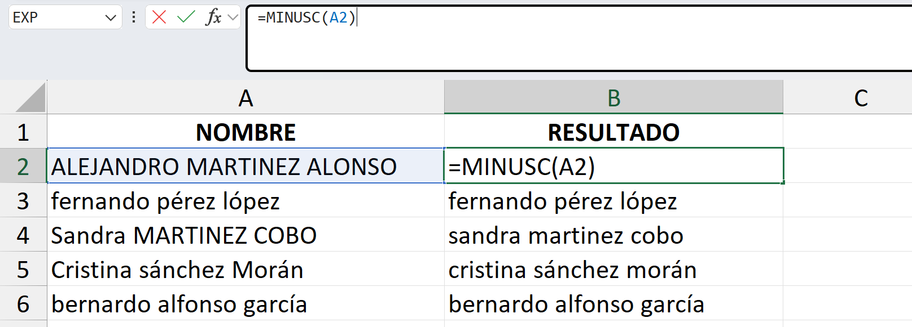

## Función MAYUSC
Convierte todas las letras de un texto a letras mayúsculas. 

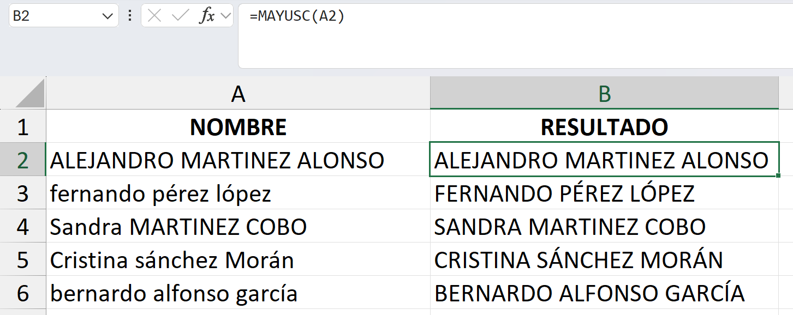

## Función NOMPROPIO
Pone en mayúscula la primera letra de cada palabra de un texto. 

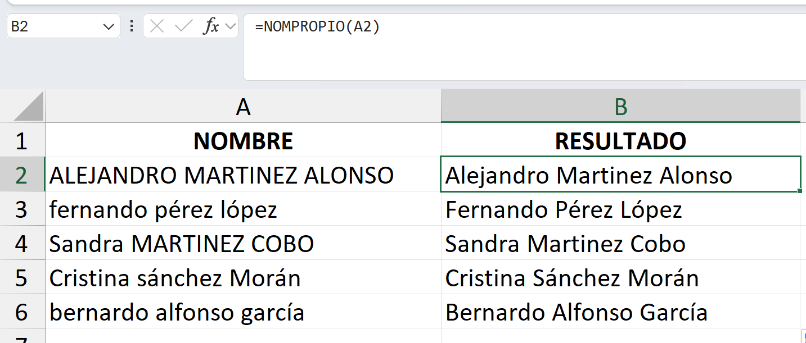

## Función ESPACIOS
Eliminar espacios al inicio, final, o 2 espacios o + seguidos en cualquier parte de la oracion.

## Función CONCAT
Permite juntar, unir o concatenar dos o más de dos cadenas de texto en una única celda.

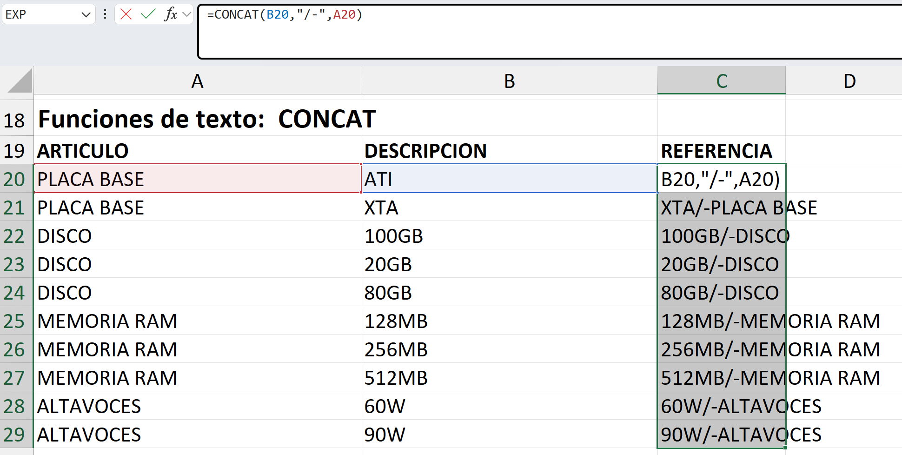

# EJERCICIO #1

# 1.2. Funciones de texto​: IZQUIERDA, DERECHA, EXTRAE

## Función IZQUIERDA
Corta o extrae los primeros caracteres de un texto. Con ella podemos extraer siempre desde el primer carácter de un texto, hacia la derecha, tantos caracteres como le indiquemos. 

Tenemos que indicar, con un número entero, el número de caracteres que queremos extraer por el principio. El argumento va escrito entre corchetes porque es un argumento opcional, esto quiere decir, que si no ponemos nada en dicho argumento, la función no va a devolver error, en ese caso cortaría el primer carácter del texto. 

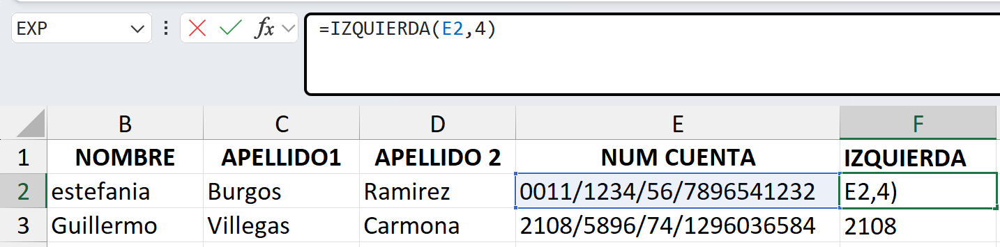

## Función DERECHA
Corta o extrae los últimos caracteres de un texto. Con ella podemos extraer siempre desde el último carácter de un texto, hacia la izquierda, tantos caracteres como le indiquemos. 

Si no ponemos nada en dicho argumento, la función no va a devolver error, en ese caso cortaría el último carácter del texto. 

## Función EXTRAE
Corta o extrae caracteres por el centro de la cadena de un texto. Segundo argumento es la posicion donde empieza el puntero, tercer argumento la cantidad de caracteres que se quiere.

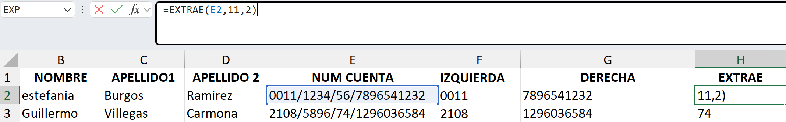

# EJERCICIO #2
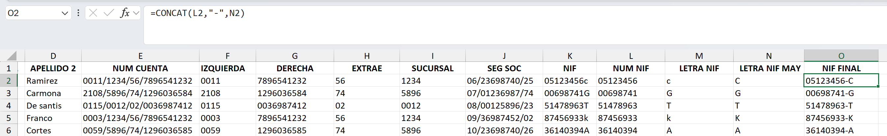

# 1.3. Funciones de texto: ENCONTRAR, LARGO

## Función ENCONTRAR
nos dice la posición que ocupa un carácter dentro de un texto. Es una función de búsqueda, ya que nos devuelve la posición de un dato. El resultado será un número entero. 

núm_incial: Es un argumento opcional, en caso de no poner nada, Excel asume que estamos poniendo el número 1.  

Desde dicho argumento, indicamos desde la posición de qué carácter de la celda que contienen el texto a buscar, queremos que nos busque el carácter del texto buscado. No poner nada, o poner el número 1, indica que buscará el texto buscado desde el primer carácter, un 2, buscaría el texto desde el segundo carácter, y así sucesivamente.

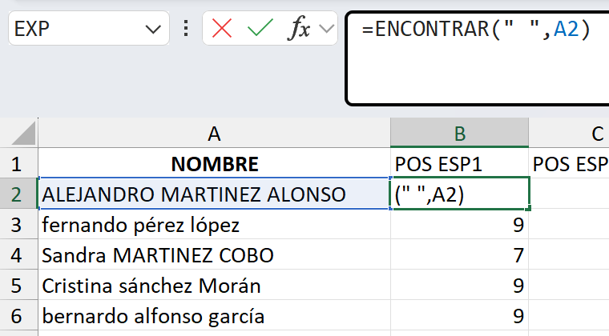
En la columna B queremos encontrar la posición del primer espacio de cada NOMBRE. 

En este caso, el argumento núm_inicial, lo hemos dejado en blanco (o podríamos haber puesto el número 1) porque buscábamos la posición del primer espacio

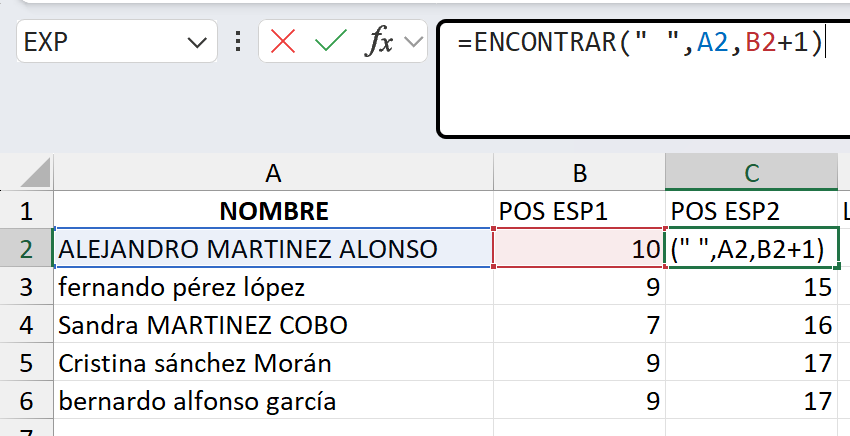
Segundo espacio, sin tomar en cuenta la posicion del primero 

## Función LARGO
Nos dice el número total de caracteres que tiene un texto
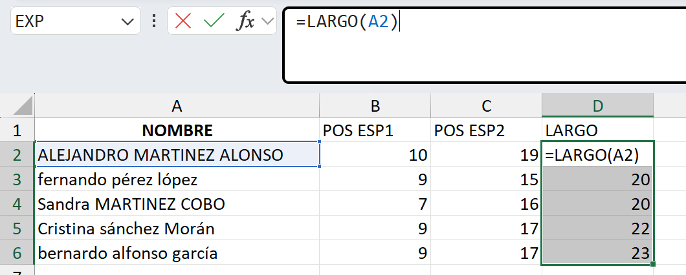

## Extraer nombres y apellidos por posiciones
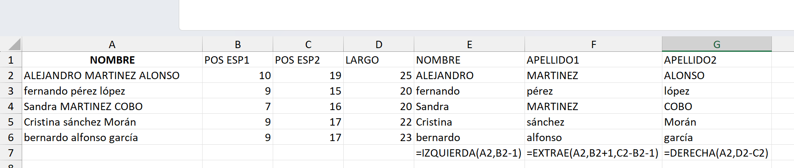

# EJERCICIO
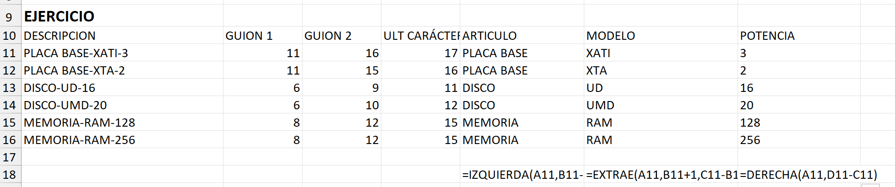

# 1.4. Funciones de texto: VALOR

## Función VALOR
Con esta función convertimos en numérico un tipo de datos texto. Eso sí, el dato texto ha de ser un número

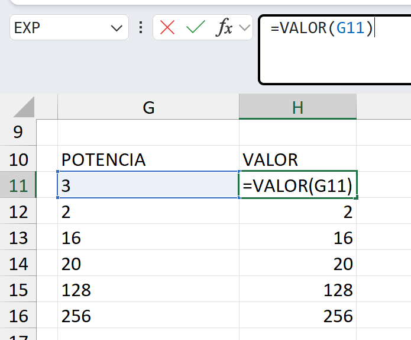

## Concatenar funciones en una misma celda
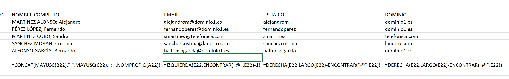

