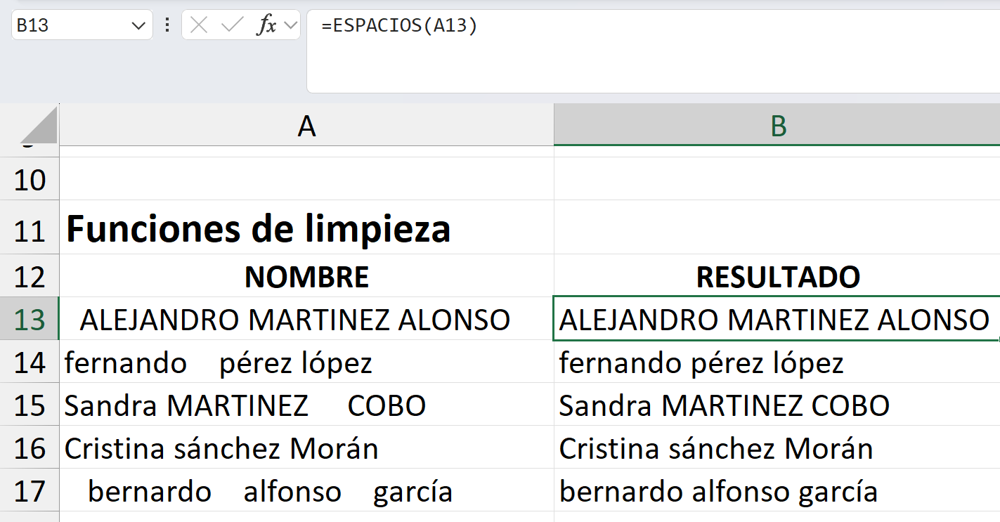
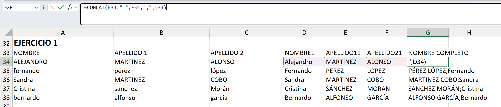
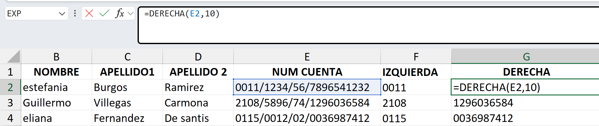

# 1. Funciones de texto​
Siempre el resultado de una función de texto será un tipo de dato texto.

## Función MINUSC 
La función MINUSC convierte todas las letras de un texto en letras minúsculas. 

## Función MAYUSC
Convierte todas las letras de un texto a letras mayúsculas. 

## Función NOMPROPIO
Pone en mayúscula la primera letra de cada palabra de un texto. 

## Función ESPACIOS
Eliminar espacios al inicio, final, o 2 espacios o + seguidos en cualquier parte de la oracion.

## Función CONCAT
Permite juntar, unir o concatenar dos o más de dos cadenas de texto en una única celda.

# EJERCICIO #1

# 1.2. Funciones de texto​: IZQUIERDA, DERECHA, EXTRAE

## Función IZQUIERDA
Corta o extrae los primeros caracteres de un texto. Con ella podemos extraer siempre desde el primer carácter de un texto, hacia la derecha, tantos caracteres como le indiquemos. 

Tenemos que indicar, con un número entero, el número de caracteres que queremos extraer por el principio. El argumento va escrito entre corchetes porque es un argumento opcional, esto quiere decir, que si no ponemos nada en dicho argumento, la función no va a devolver error, en ese caso cortaría el primer carácter del texto. 

## Función DERECHA
Corta o extrae los últimos caracteres de un texto. Con ella podemos extraer siempre desde el último carácter de un texto, hacia la izquierda, tantos caracteres como le indiquemos. 

Si no ponemos nada en dicho argumento, la función no va a devolver error, en ese caso cortaría el último carácter del texto. 

## Función EXTRAE
Corta o extrae caracteres por el centro de la cadena de un texto. Segundo argumento es la posicion donde empieza el puntero, tercer argumento la cantidad de caracteres que se quiere.

# EJERCICIO #2

