# 2. Funciones de fecha

Como las fechas son datos numéricos, el resultado, siempre de una función de fecha, es un tipo de datos numérico.

# 2.1. Funciones de fecha: DIA, MES, AÑO, DIASEM, FECHA + NÚMERO, DIA.LAB.INTL

## Función DIA

La función DIA, nos devuelve el día de una fecha como número del 1 al 31.

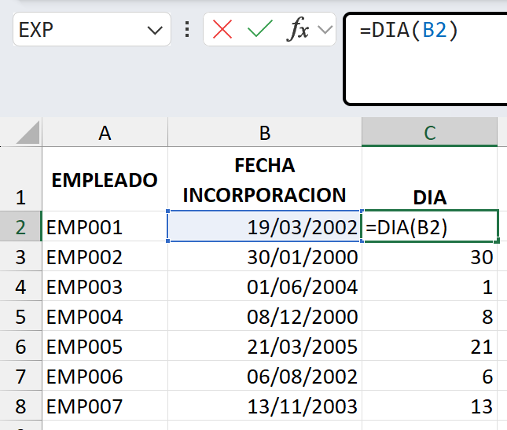

## Función MES

Nos devuelve el mes de una fecha como número de 1 al 12

## Función AÑO

Nos devuelve los cuatro dígitos del año de una fecha.

## Función DIASEM

Nos devuelve el día de la semana de una fecha como número del 1 al 7.

## Función FECHA + NÚMERO

Cuando a una fecha le sumamos un número, le estamos sumando días naturales, es decir, días de lunes a viernes. Por tanto, el resultado de sumar a una fecha un número, es otra fecha tantos días más tarde como el número que le estamos sumando

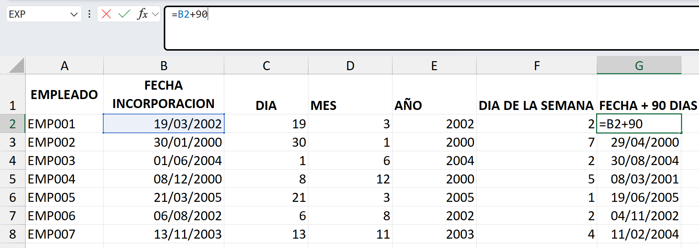

## Función DIA.LAB.INTL

Con esta función le podemos sumar a una fecha días laborables, indicando nosotros qué días corresponden al fin de semana y los días festivos que se puedan tener, y nos devuelve una fecha tantos días laborables más tarde que la fecha inicial como corresponda.

### Sintaxis:

DIA.LAB.INTL(fecha_inicial;días;[fin_de_semana];[días_no_laborables])

### Argumentos:

Fecha_inicial
Días: el número de días laborables que se quiere sumar
[fin_de_semana]: argumento opcional en el que se le tiene que indicar qué día/ s corresponde al fin de semana. por defecto: sábado y domingo.
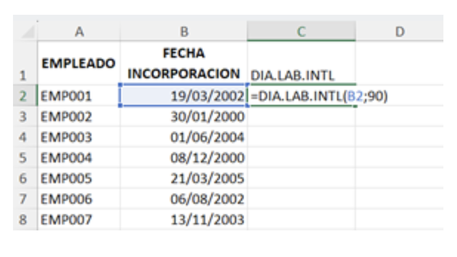
[días_no_laborables]: es un argumento opcional, en el que se seleccionaría un rango de celdas donde estuvieran escritas las fechas de los días festivos, para que los tome como días no laborables. Por defecto, todos son laborales excepto el fin de semana.

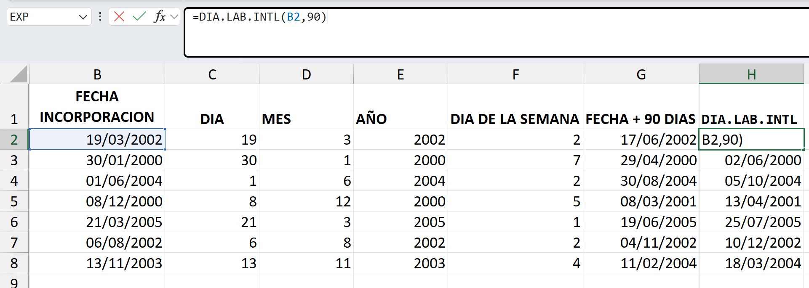

# EJERCICIO

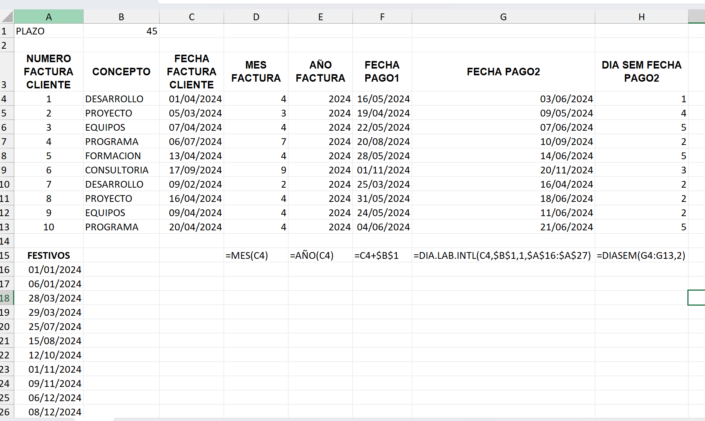

# 2.2. Funciones de fecha: FECHA, FIN.MES, DIAS.LAB.INTL, HOY, TEXTO

## Función FECHA

La función FECHA nos permite calcular una fecha indicando nosotros el día, mes y año que ha de tener la fecha que estamos calculando.

1. AÑO
2. MES
3. DIA

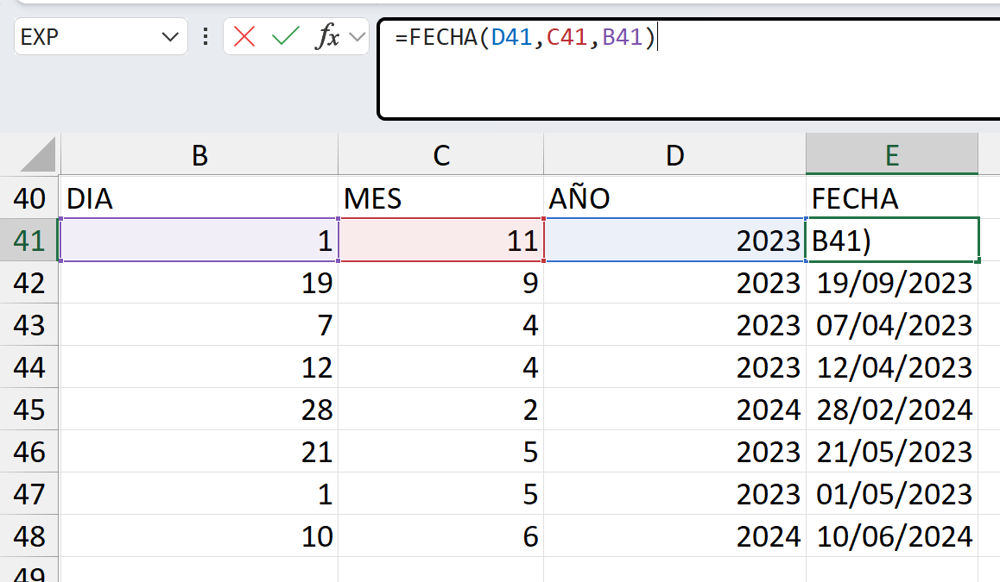

# EJERCICIO

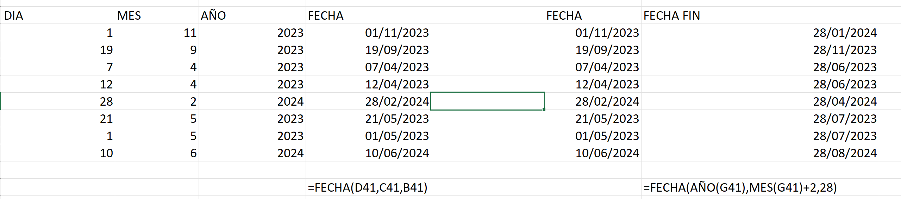

## Función FIN.MES

Con esta función sumamos un número de meses a una fecha, y devuelve como resultado otra fecha, tantos meses más tarde como le sumamos, y siempre el último día del mes.

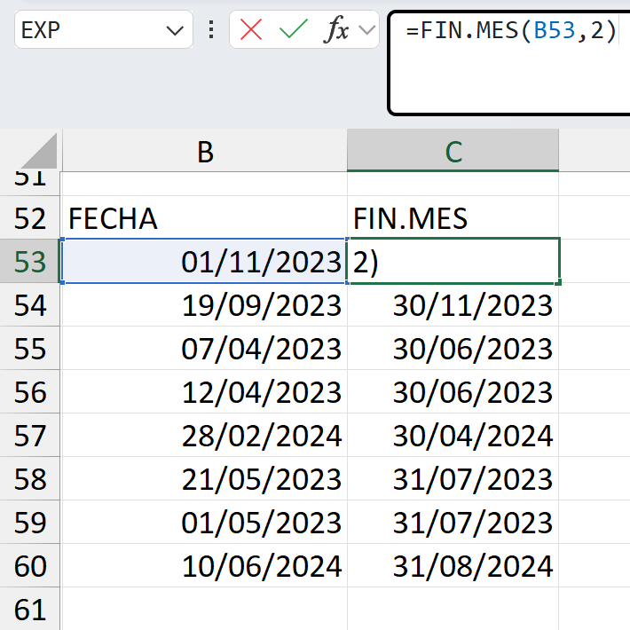

El segundo parametro es el numero de meses a sumar.

## Restar dos fechas

Cuando restamos dos fechas, lo que estamos calculando es el número de días naturales (de lunes a domingo) que han transcurrido entre ambas fechas.

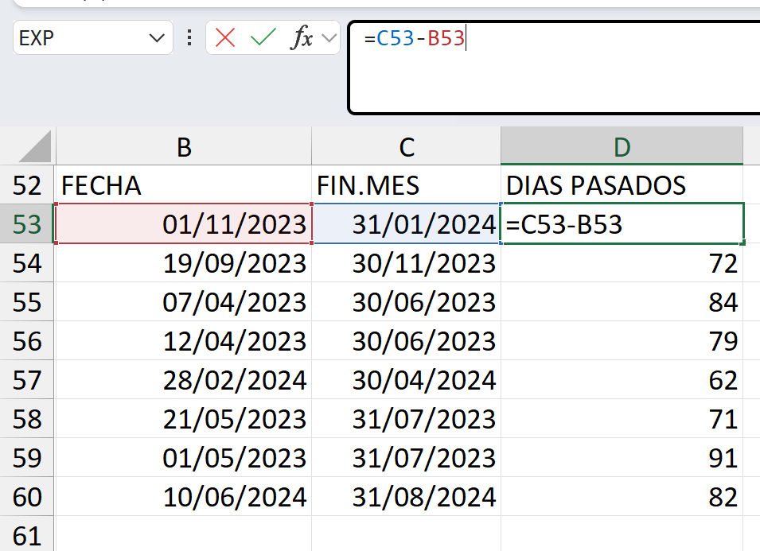

## Función DIAS.LAB.INTL

Con esta función calculamos el número de días laborables transcurridos entre dos fechas.

### Sintaxis:

DIAS.LAB.INTL(fecha_inicial;fecha_final;[fin_de_semana];[días_no_laborables])

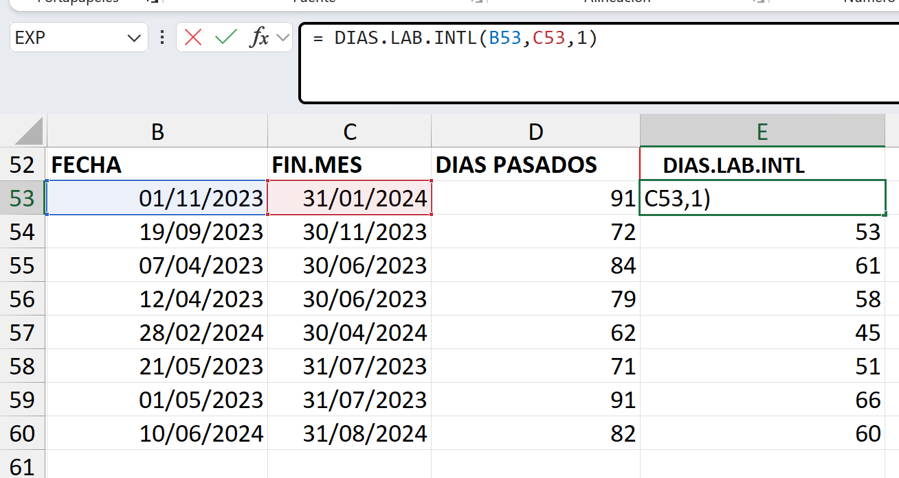

## Función HOY

es una función que no tiene ningún argumento, lo que hace es devolvernos las fecha del día actual, de tal manera, cada día se va a ir actualizando automáticamente a la fecha del día concreto.

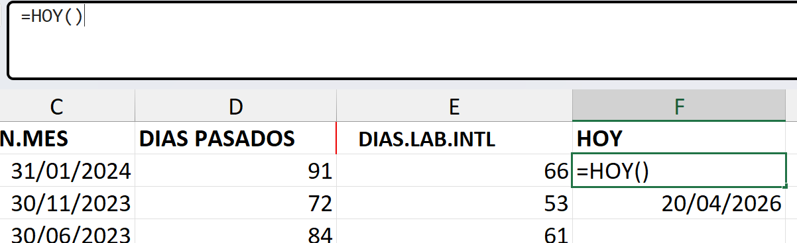

## Función TEXTO

es una función de texto, por lo que el resultado siempre será un tipo de dato texto.

Lo que hacer es obtener texto de un tipo de dato numérico. Como las fechas son datos numéricos, la función TEXTO se aplica sobre ellas para obtener texto de una fecha.

- D: devuelve el día en un dígito, como tipo de dato texto, alienado a la izquierda (1, 2, 3… 31)
- DD: devuelve el día de la fecha en dos dígitos como tipo de dato texto: 01, 02, 03… 31
- DDD: devuelve las iniciales del nombre del día de la semana de la fecha: lu, ma, mi… do.
- DDDD: devuelve el nombre completo del día de la semana de la fecha: lunes, martes… domingo.

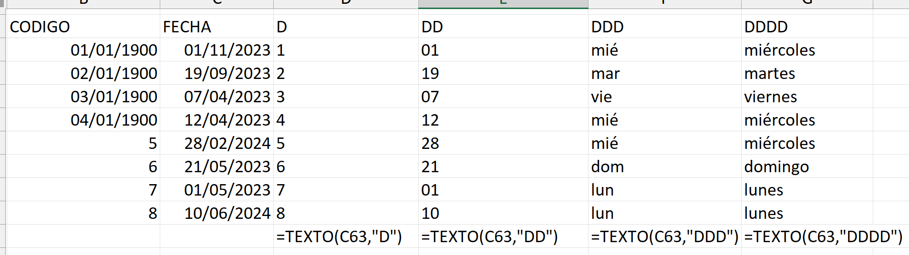

- M: devuelve el mes de la fecha en un dígito, como tipo de dato texto: 1, 2, …,12.
- MM: devuelve el mes de la fecha en dos dígitos, como tipo de dato texto: 01, 02, …, 12.
- MMM: devuelve las iniciales del nombre del mes de la fecha: ene, feb, mar, …, dic.
- MMMM: devuelve el nombre completo del mes de la fecha: enero, febrero, …, diciembre.

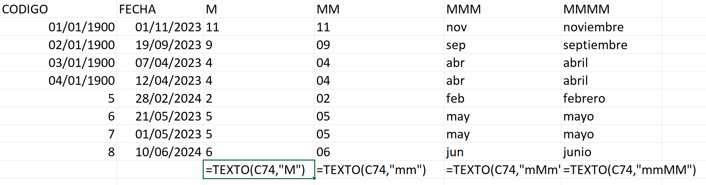

- AA: muestra los dos últimos dígitos del año como tipo de dato texto: 20, 21, 22, …
- AAAA: muestra los cuatro dígitos del año como tipo de dato texto: 2020, 2021, 2022, …

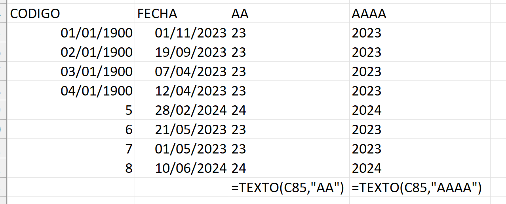

Para convertir un número en texto, en el argumento formato de la función TEXTO, debemos poner entre comillas tantos números 0 como dígitos queremos que muestre el número

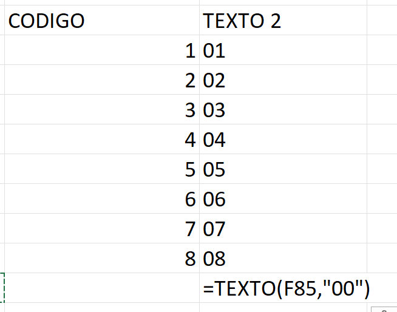

# EJERCICIO

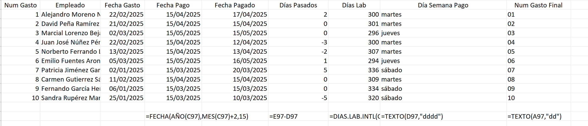
