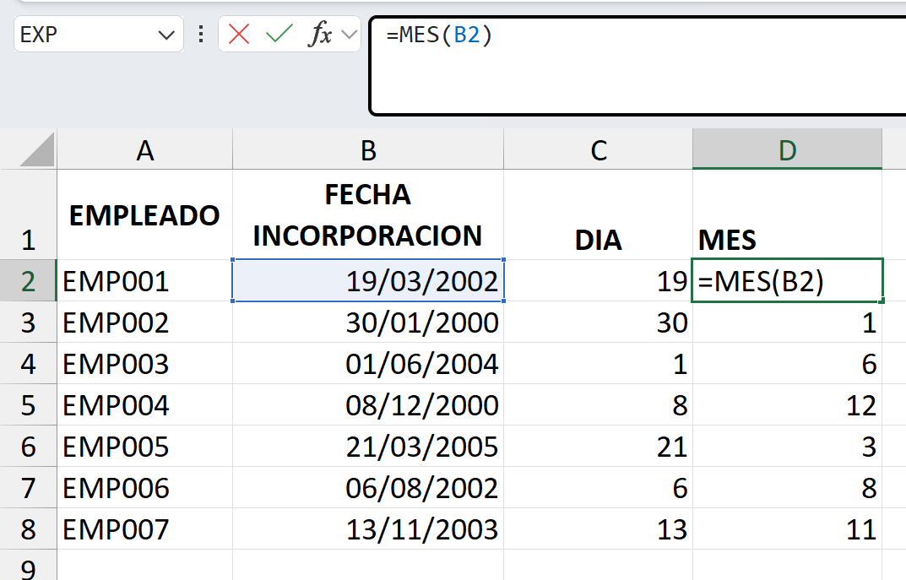
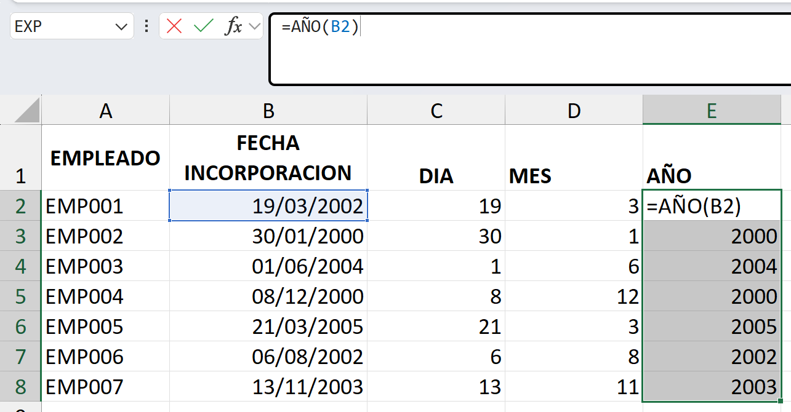
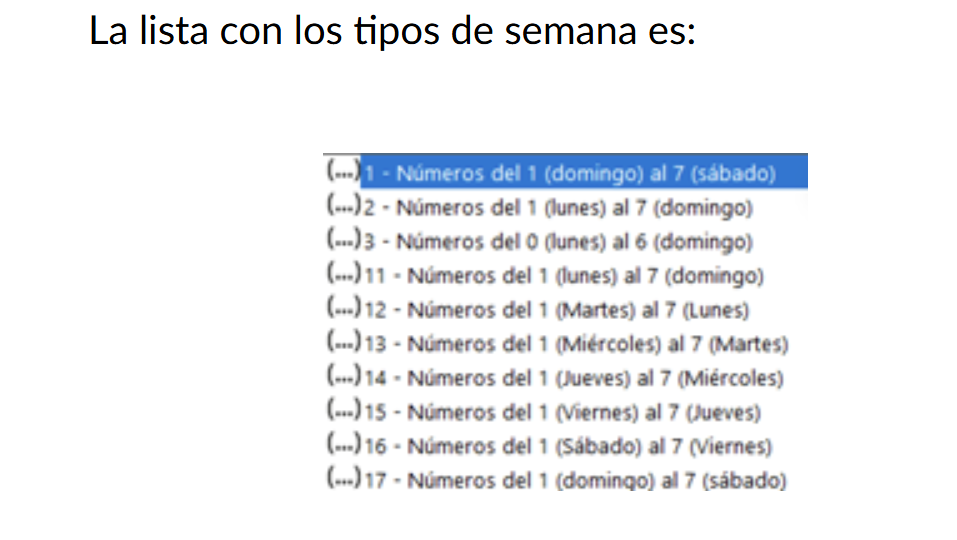
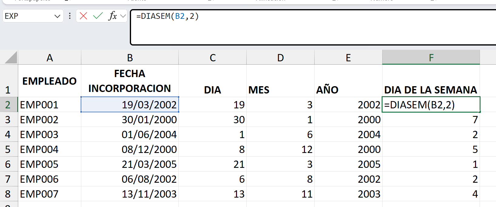

# 2. Funciones de fecha
Como las fechas son datos numéricos, el resultado, siempre de una función de fecha, es un tipo de datos numérico.

# 2.1. Funciones de fecha: DIA, MES, AÑO, DIASEM, FECHA + NÚMERO, DIA.LAB.INTL

## Función DIA
La función DIA, nos devuelve el día de una fecha como número del 1 al 31.

## Función MES
Nos devuelve el mes de una fecha como número de 1 al 12

## Función AÑO
Nos devuelve los cuatro dígitos del año de una fecha. 

## Función DIASEM
Nos devuelve el día de la semana de una fecha como número del 1 al 7.

## Función FECHA + NÚMERO
