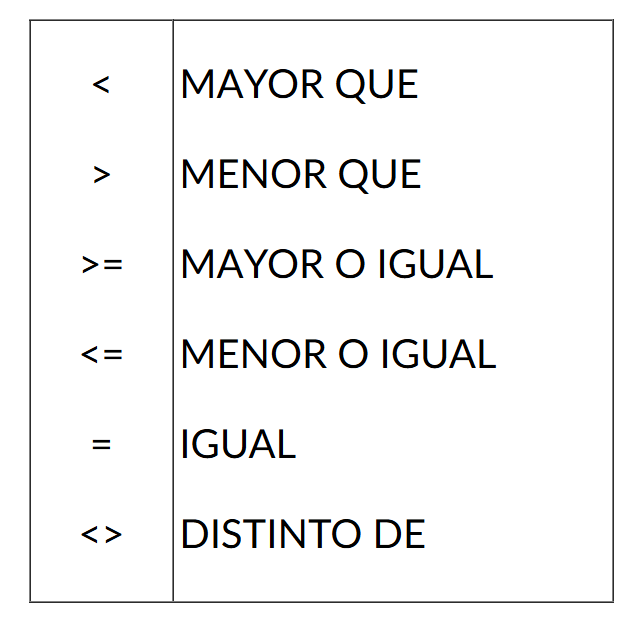
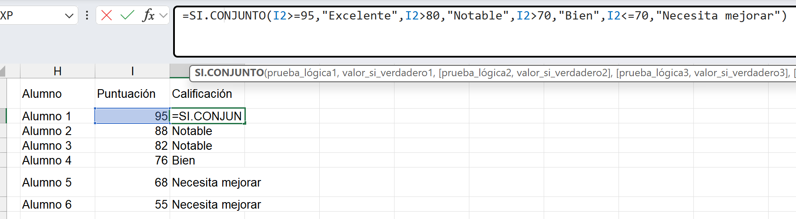
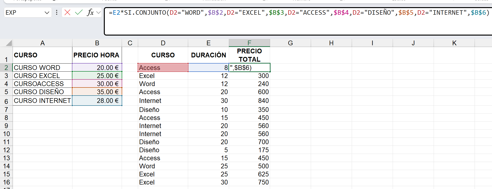
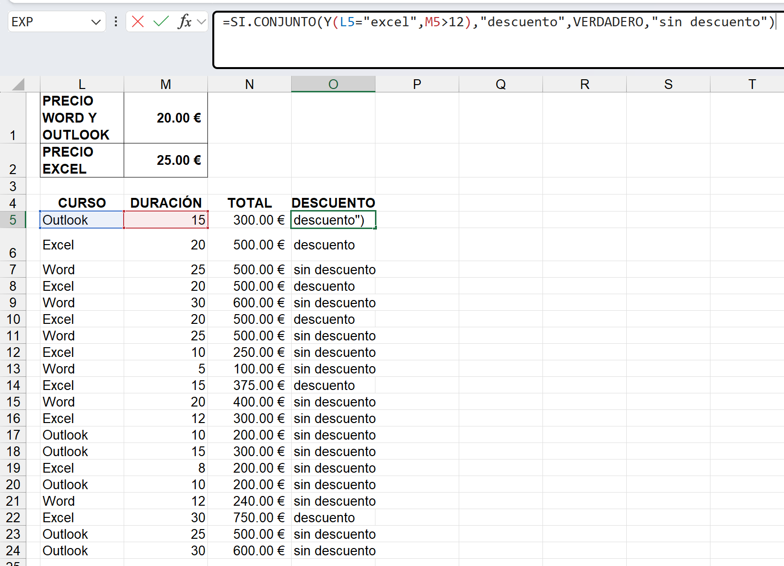
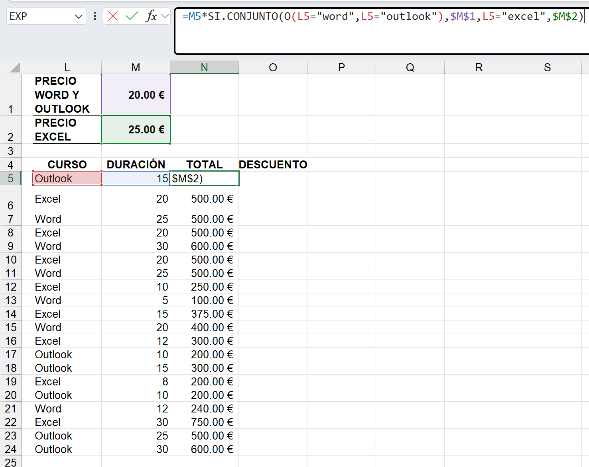

# 3. Función SI.CONJUNTO
La función SI.CONJUNTO, es una versión mejorada de la función SI tradicional, permitiendo evaluar múltiples condiciones de manera más eficiente. Con ella, analizaremos diferentes condiciones y nos devolverá un resultado basado en la primera de todas las condiciones que se cumpla.

## Sintaxis:
SI.CONJUNTO(Prueba_lógica1;valor_si_verdadero1;[prueba_lógica2;valor_si_verdadero2],…)

La función admite 63 pruebas lógicas diferentes, teniendo en cuenta que a cada prueba lógica le corresponde un valor si verdadero, en total la función admite hasta 126 argumentos.

En la prueba lógica podemos usar comparadores(Las pruebas lógicas siempre han de ser comparación de dos valores):

Los argumentos valor si verdadero, es el resultado que queremos que devuelva la función cuando se cumpla la prueba lógica correspondiente.

Una condición múltiple con SI.CONJUNTO. Toma el valor de E2 y lo multiplica por un precio/valor dependiendo de lo que diga D2.

Es posible, que para establecer alguno de los valores de la función SI.CONJUNTO, en vez de tener una condición, tengamos que analizar más de una condición. Si se da este caso, habría que analizar las condiciones, bien dentro de una función Y, o bien dentro de la función O
### Formula:
=E2*SI.CONJUNTO(D2="WORD",$B$2,D2="EXCEL",$B$3,D2="ACCESS",$B$4,D2="DISEÑO",$B$5,D2="INTERNET",$B$6)

### Qué significan los $
Es referencia fija / absoluta.

Significa que al arrastrar la fórmula no cambia.

Siempre seguirá apuntando a cierta celda.

### ¿Mayúsculas y minúsculas importan?
Normalmente NO. Excel por defecto no distingue mayúsculas/minúsculas en comparaciones comunes.
- ="WORD"="word"

Si quisieras que sí distinga, usa:
- =EXACTO("WORD","word")

### Hacer celdas absolutas con comandos
Fn + F4

1. B2 → Referencia relativa

Nada está fijo.

2. $B$2 → Referencia absoluta total

No cambia nunca.

3. B$2 → Fila fija, columna variable

4. $B2 → Columna fija, fila variable

## Función Y
Es una función lógica, cuyo resultado será verdadero o falso, permite analizar tantas condiciones como tengamos, y devolverá como resultado VERDADERO en el caso de que todas las condiciones analizadas se cumplan. Devolverá FALSO, con que al menos una de las condiciones no se cumpla.

Argumentos:
- Valor_lógico1: primera condición que queremos analizar.
- [valor_lógico2]: argumento opcional, es la segunda condición.
- Se pueden llegar a valorar hasta un máximo de 255 condiciones lógicas.

## Función O
Es una función lógica. Permite analizar tantas condiciones como tengamos, y devolverá como resultado VERDADERO cuando de todas las pruebas lógicas que se analiza al menos se cumpla una. Devuelve FALSO si no se cumple ninguna de las condiciones analizadas.

Sintaxis: O(valor_lógico1;[valor_lógico2];…).

## Función VERDADERO
Utilizamos esta función, que no tiene ningún argumento ni hace falta usar paréntesis, dentro de la función SI.CONJUNTO, en cualquier argumento Prueba lógica, para hacer referencia al resto de casos, si todos tienen un mismo resultado, y así no tener que están analizando cada uno de manera individual.

Es el resultado de una condición que sí se cumple.

Su opuesto es: FALSO

Puede actuar como un caso por defecto / comodín final.

### Fórmula
=SI.CONJUNTO(
Y(L5="excel",M5>12),"descuento",
VERDADERO,"sin descuento"
)

Aquí no está comparando nada.
Es literalmente una condición que siempre se cumple.

Entonces significa: Si no se cumplió la primera condición, usa esto.

Es equivalente a: ELSE en programación.