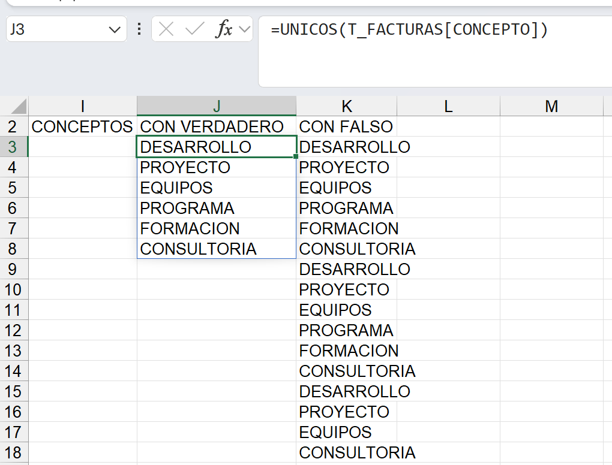
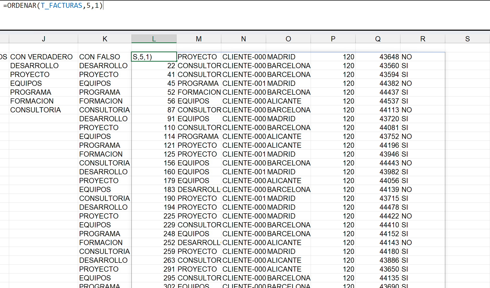
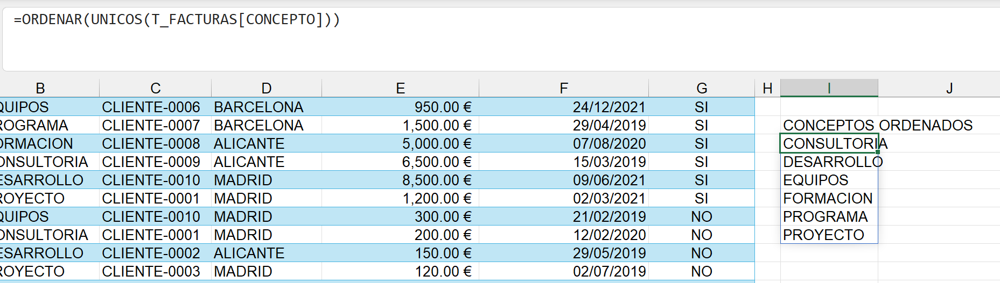
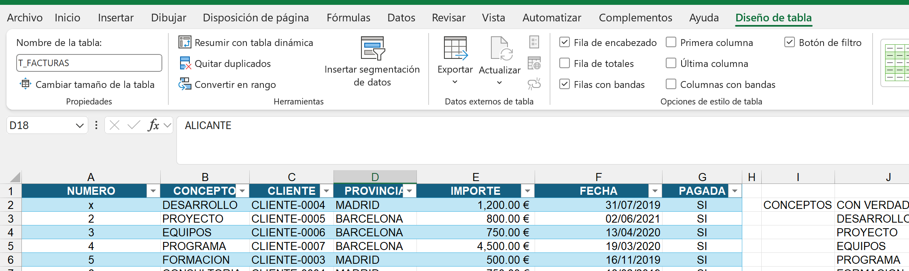
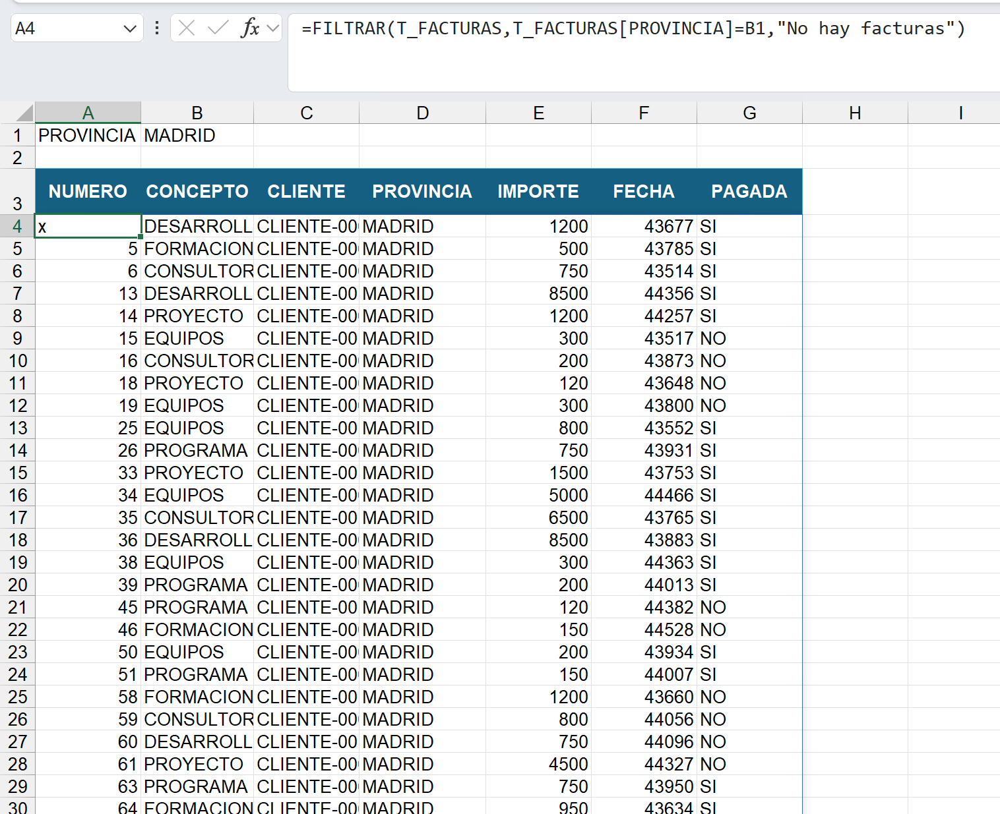
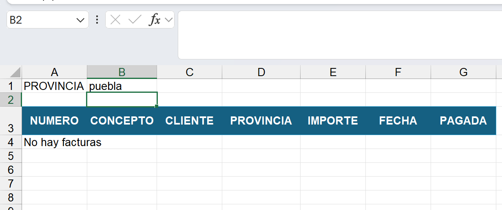
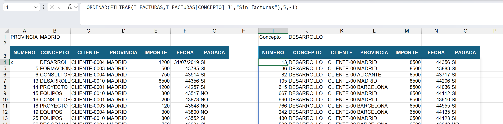
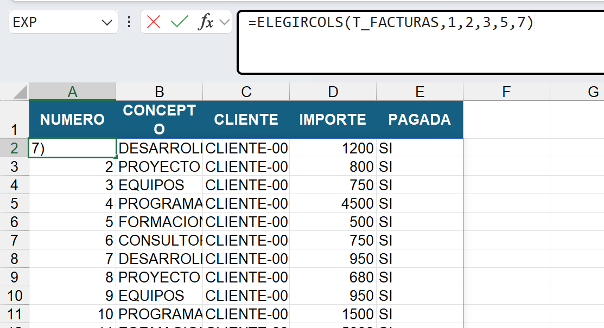
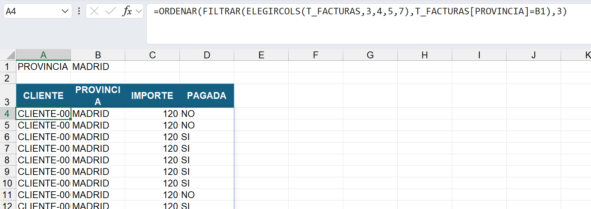

# 4. Funciones matriciales

Las funciones matriciales son funciones que se escriben en una celda y el resultado lo devuelve a lo largo de un rango de celdas.

Las funciones matriciales siempre devuelven valores de los registros de una tabla de datos o de un rango.

# 4.1. Función UNICOS

Devuelve los diferentes elementos de un rango de celdas, bien de una columna de datos o bien de una tabla o rango.

### Sintaxis:

UNICOS(matriz;[by_col];[exactly_once])

1. de donde se quieren obtener los elementos únicos.
2. Argumento opcional:
   - FALSO o 0(por defecto): se le indica que los valores de los que se quieren obtener los elementos únicos están en cada fila del rango (se eliminan filas duplicadas).
   - VERDADERO o 1: busca valores únicos en cada columna del rango seleccionado (se eliminan columnas duplicadas).
3. Argumento opciona:
   - FALSO o 00(por defecto): devuelva todos los diferentes elementos del rango seleccionado.
   - VERDADERO o 1: devuelve solo aquellos elementos del rango seleccionado que están escritos únicamente una sola vez.

El resultado de una fórmula matricial no lo podemos modificar, es decir, no podríamos ordenar los elementos o insertar una tabla sobre ellos, ya que el resultado siempre es un rango

El orden en el que trae los elementos es el orden en el que se encuentran estos dentro de la columna

Las fórmulas matriciales, solo se pueden eliminar o modificar en la propia celda en la que han sido escritas.

# 4.2. Función ORDENAR

Devuelve un rango de celdas seleccionado ordenado por la columna que le indiquemos.

### Sintaxis:

ORDENAR (matriz;[ordenar_índice];[criterio_ordenación];[por_col])

1. Rango que se desea ordenar.
2. Opcional, número de columna o fila del rango por el que se quiere ordenar la matriz.
3. Opcional, se indica el orden deseado: 1, es ascendente. -1, descendente.
4. Opcional,se le indica la dirección de ordenación del rango seleccionado:
   - vacío o falso: se ordena por filas
   - Verdadero: el orden sería por columnas.

Si quiero pasar con texto:

    =ORDENAR(A2:C4;COINCIDIR("Edad";A1:C1;0);1)

Las funciones matriciales siempre devuelven las fechas con formato de número general.

### Saber el nombre de una tabla.

# 4.3. Función FILTRAR

Devuelve los registros de una tabla de datos o rango con un filtro aplicado establecido por nosotros.

### Sintaxis:

    FILTRAR(matriz;incluir;[si_vacío])

- Rango o tabla sobre el que se va a aplicar el filtro.
- Criterio por el que se desea filtrar.
- Opcional, indicar el resultado que debe devolver la función en caso de que ningún registro de la tabla cumpla con el criterio establecido

En caso se que no haya resultados:

# EJERCICIO

# 4.4. Función ELEGIRGIRCOLS

traer las columnas que seleccionemos de una tabla o rango específico.

### Sintaxis:

ELEGIRCOLS(matriz;col_num1;[col_num2];…)

- Rango o tabla sobre la que se quieren seleccionar las columnas.
- Número de la columna de la tabla que se quiere traer.

