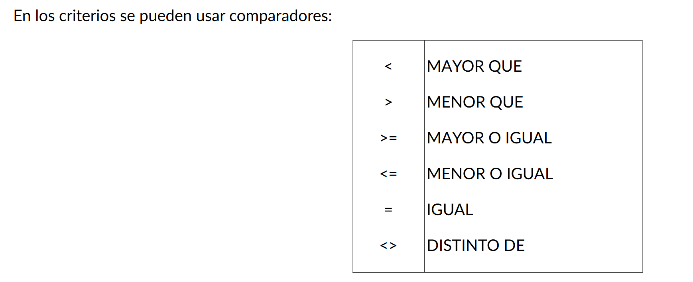
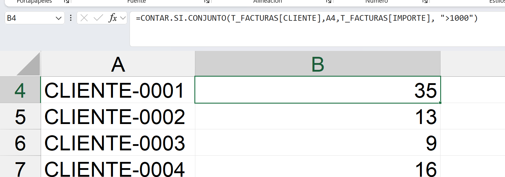
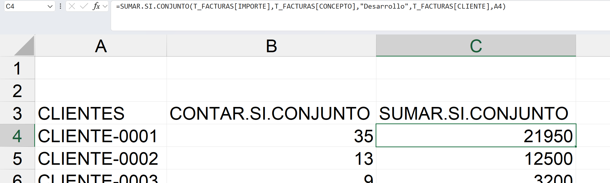
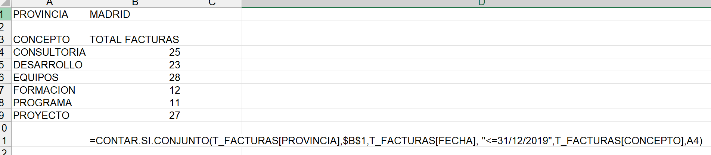
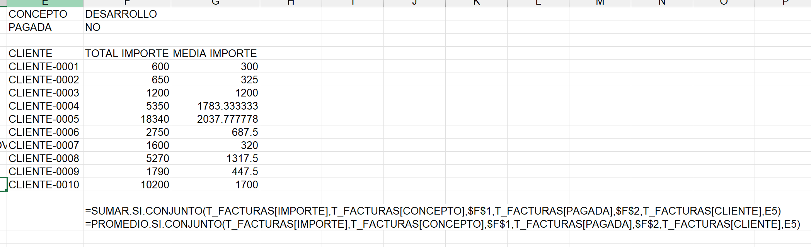

# 5. Funciones .CONJUNTO

# 5.1. Función CONTAR.SI.CONJUNTO
Cuenta todos los elementos de un rango o tabla que cumplan con todos los criterios que nosotros establezcamos.

### Sintaxis:
CONTAR.SI.CONJUNTO(rango_criterios1;criterio1;…)

Contar el número de facturas realizadas a cada cliente con importe mayor de 1000. 

# 5.2. Función SUMAR.SI.CONJUNTO
Podemos sumar un rango de celdas, bajo todos los criterios que nosotros establezcamos, se pueden establecer un máximo de 122 criterios. Los criterios se emplean del mismo modo que en la función CONTAR.SI.CONJUNTO.

### Sintaxis:

SUMAR.SI.CONJUNTO(rango_suma;rango_criterios1;criterio1;…)

- rango o columna que queremos sumar con la función.
- rango o columna que queremos establecer un primer criterio.
- Criterio que debe de cumplir el primer rango de criterios.

sumar el importe de cada cliente de las facturas realizadas con el concepto DESARROLLO.

De manera similar a la función SUMAR.SI.CONJUNTO se pueden aplicar las funciones: PROMEDIO.SI.CONJUNTO, MAX.SI.CONJUNTO, MIN.SI.CONJUNTO, el único argumento que cambia en cada una de ellas es el primero, donde se seleccionará el campo o columna de la cual se quiera calcular.

# EJERCICIOS

