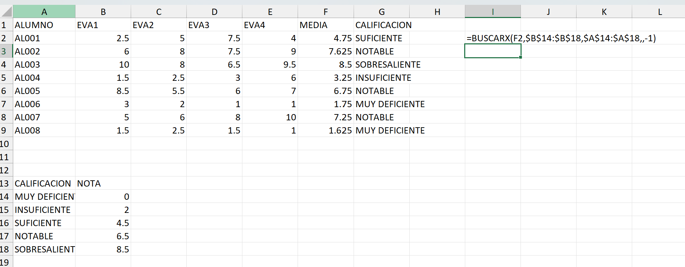
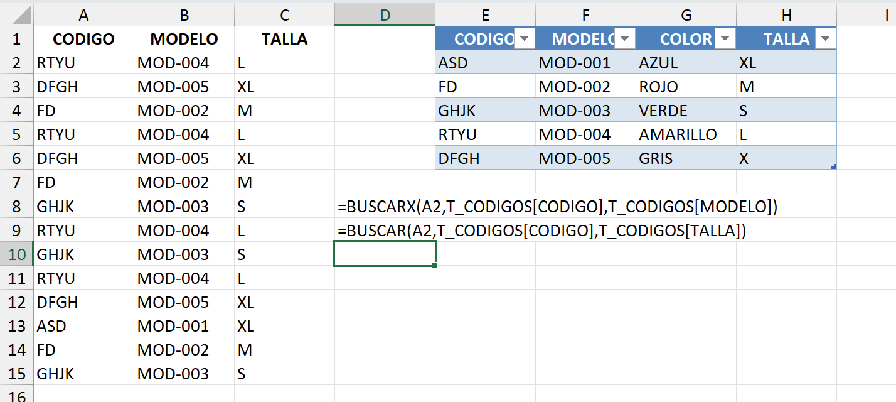

# 6. Función BUSCARX
Al igual que la función BUSCARV, esta función busca información de un valor dentro de un rango o matriz y nos devuelve su valor asociado desde otro rango.

Permite realizar búsquedas tanto en vertical como en horizontal, y no necesita que la columna coincidente de la tabla principal esté situada en la primera posición. No tiene en cuenta la disposición de las columnas y/o filas de la tabla catálogo en la que se busca la información.

### Sintaxis:

BUSCARX(valor_buscado;matriz_buscada;matriz_devuelta;[si_no_se_encuentra];[modo_de_coincidencia];[modo_de_búsqueda])

- valor del cual estamos buscando información.
- rango o columna / fila en la que queremos que localice el valor buscado en la tabla que tiene la información que estamos buscando.
- rango o columna / fila que queremos que nos devuelva como resultado de la tabla que contiene la información que buscamos
- Opcional, indicar qué resultado queremos que nos devuelva la función, en caso de no estar el valor buscado en la matriz buscada.
- Opcional, determina el tipo de coincidencia que queremos obtener en la búsqueda:

    -       0: coincidencia exacta(por defecto)
    -       -1: coincidencia exacta o el siguiente valor menor al  buscado.
    -       1: Coincidencia exacta o el siguiente valor mayor al  buscado.
    -       2: Coincidencia con comodines,  utilizar en la búsqueda caracteres comodines como: * (reemplazar cadena indeterminada de caracteres) y ? (reemplazar un carácter en la posición del texto del valor buscado que le coloquemos).
- Opcional, define el orden en el que se realiza la búsqueda:

    -       1: búsqueda del primero al último (opción predeterminada).
    -       -1: búsqueda del último al primero.
    -       2: búsqueda binaria ascendente: obliga a que la matriz buscar en esté ordenada en orden ascendente.
    -       -2: búsqueda binaria descendente: requiere que la matriz buscar en, esté ordenada en orden descendente.

# EJERCICIO.

