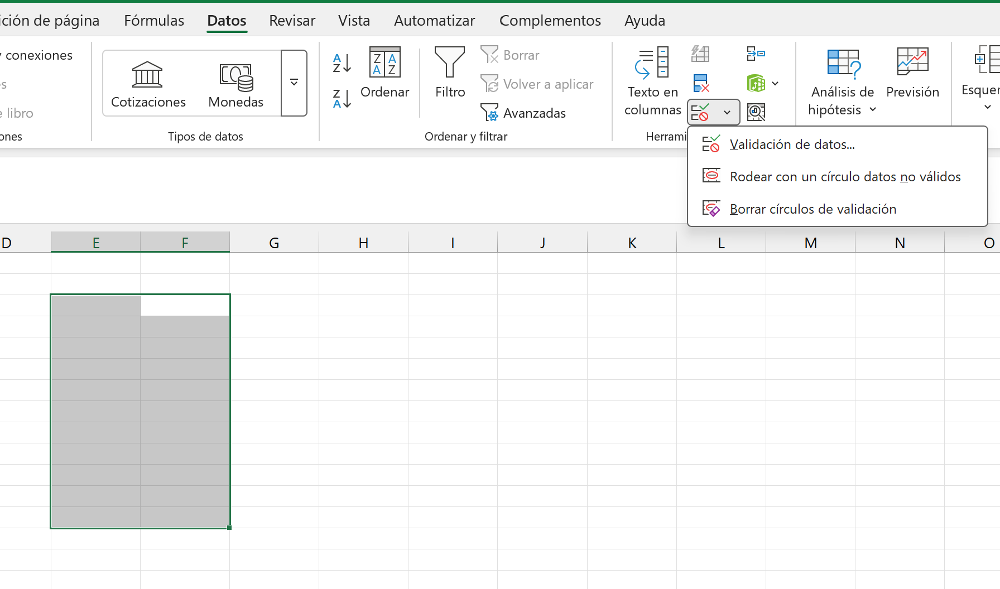
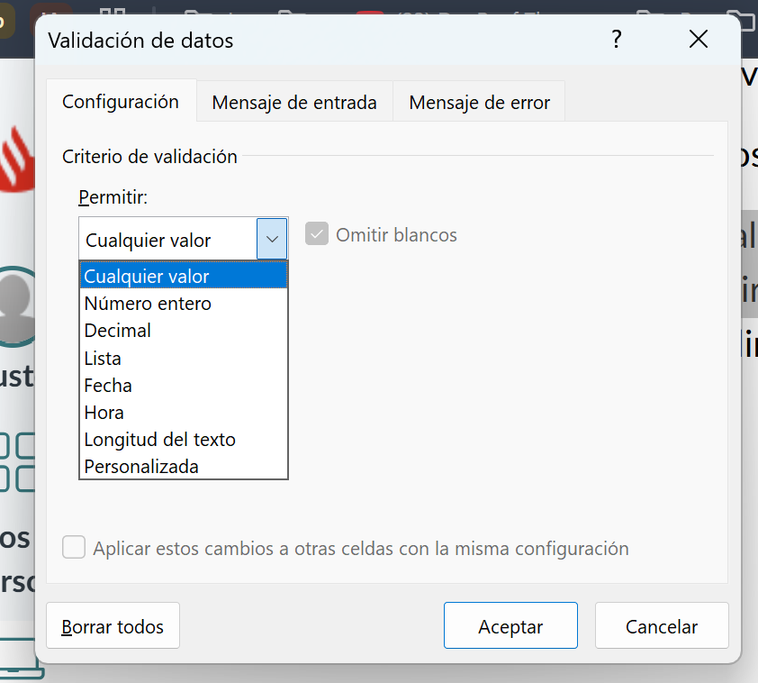
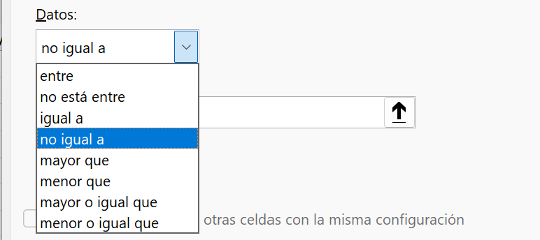
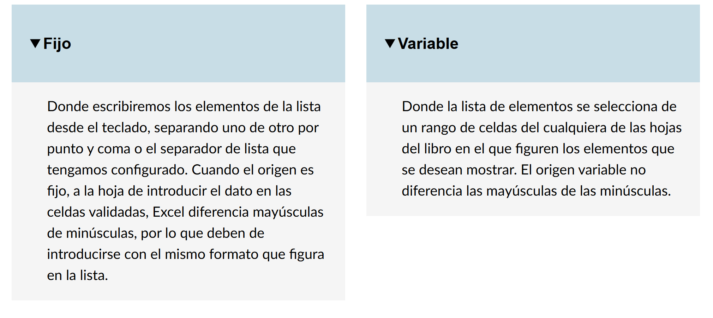
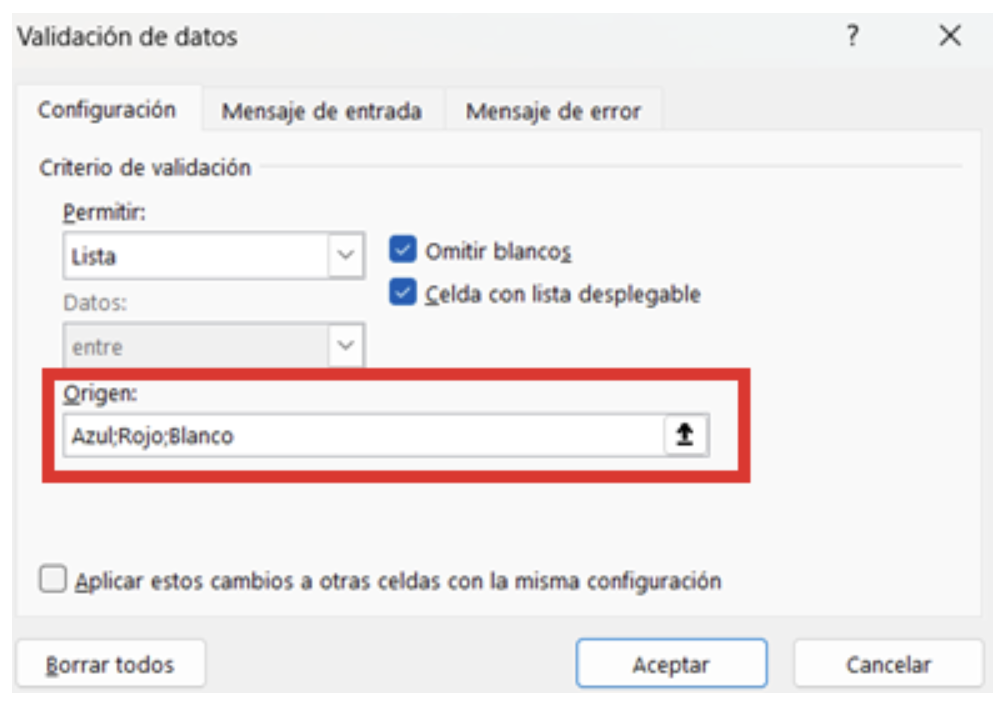
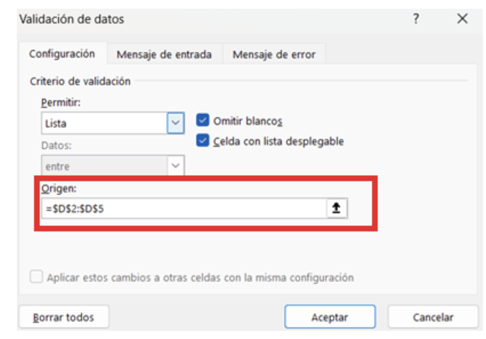
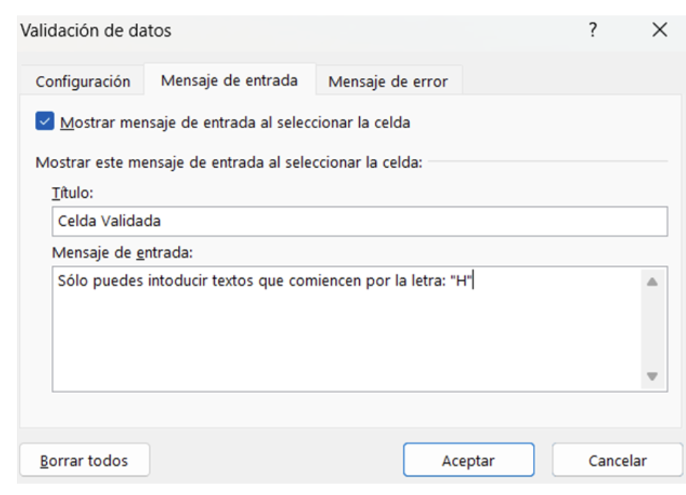
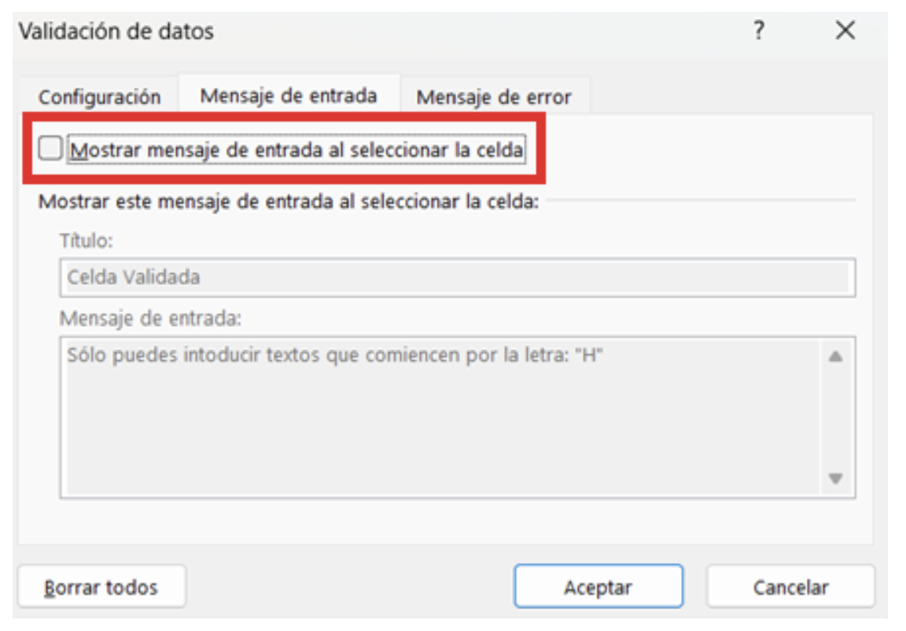
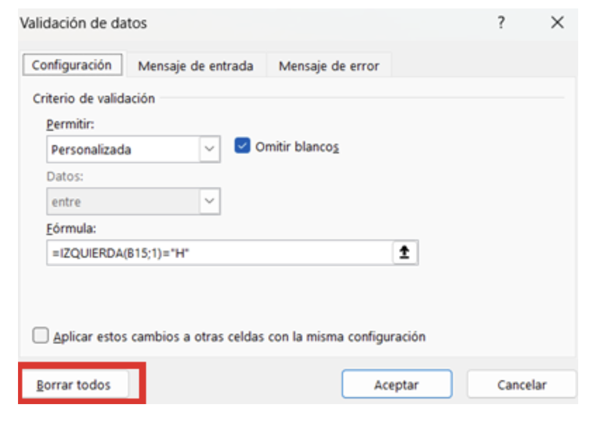

# 7. Validaciones de datos

Mediante las validaciones de datos, se puede restringir los datos que se introduzcan en determinadas celdas que previamente se hayan seleccionado.

Para realizar una validación de datos, tendremos primero que seleccionar las celdas que queramos validar o restringir el permiso

Si introducimos un valor inadeacuado se mandara una ventana de alerta.
De tal modo, que si pulsamos el botón REINTENTAR, nos hace introducir un nuevo número. Si pulsamos el botón CANCELAR, eliminar el número introducido.

### Para elemento lista:

### Origen fijo:

### Origen variable:

También podemos establecer un mensaje de información cada vez que nos situemos en una celda que esté validada, para ello, seleccionamos la celda o rango de celdas que tengan la validación y entramos en la ventana de validación de datos.

En caso de que queramos desactivar dicho mensaje, entramos con la celda/ s seleccionada/ s a la ventana de validación de datos, vamos a la pestaña Mensaje de entrada, y desactivamos el check: Mostrar mensaje de entrada al seleccionar la celda.

Finalmente, para eliminar una validación establecida a una celda o rango de celdas, seleccionaremos dicha celda/ s

