# 8. Formato condicional

permite resaltar visualmente información relevante dentro de un conjunto de datos según los criterios que nosotros establezcamos en las reglas para aplicar dicho formato.

El formato condicional, podemos aplicarlo tanto a una celda, como a un rango de celdas.

Antes de aplicar el formato condicional, tendremos que seleccionar la celda o rango que queramos resaltar

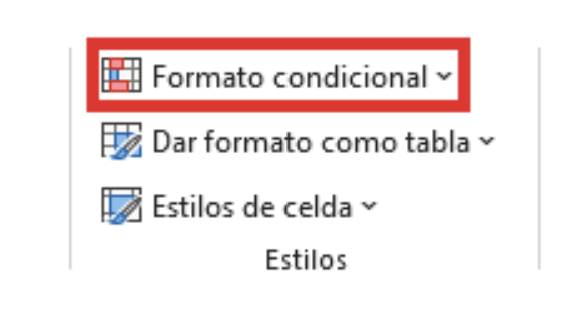
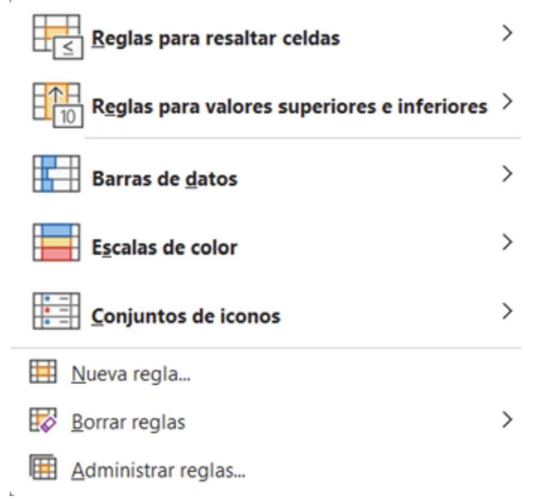

1. Reglas para resaltar celdas: establecer nosotros una condición concreta de comparación.

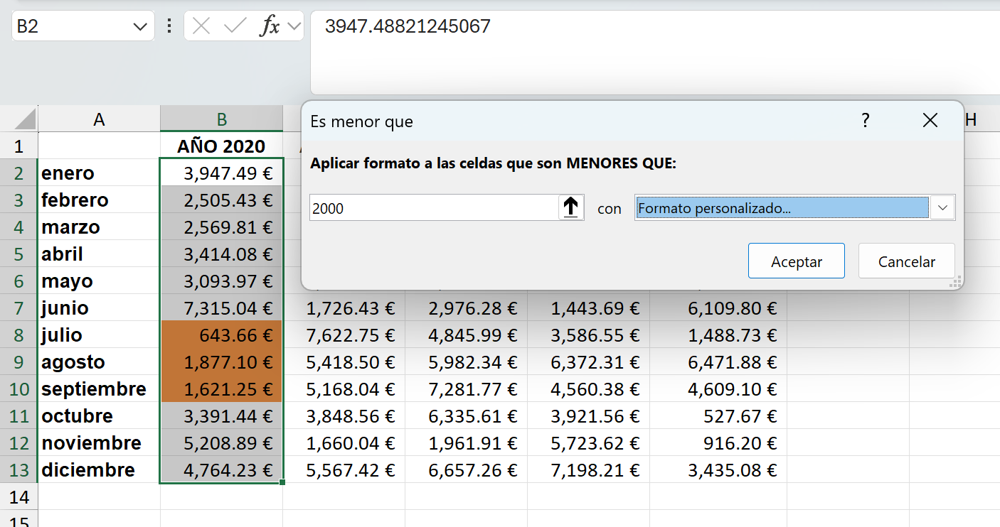
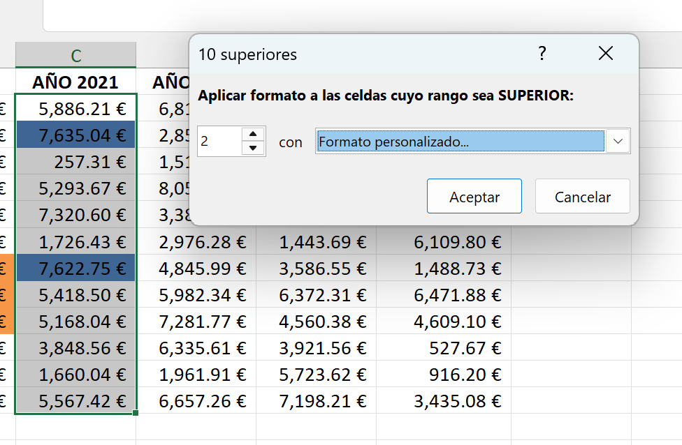

2. Barras de datos: Para poner una barra en cada una de las celdas seleccionadas, que mediante su tamaño mide si el valor es de los altos, bajos o medios del rango seleccionado.

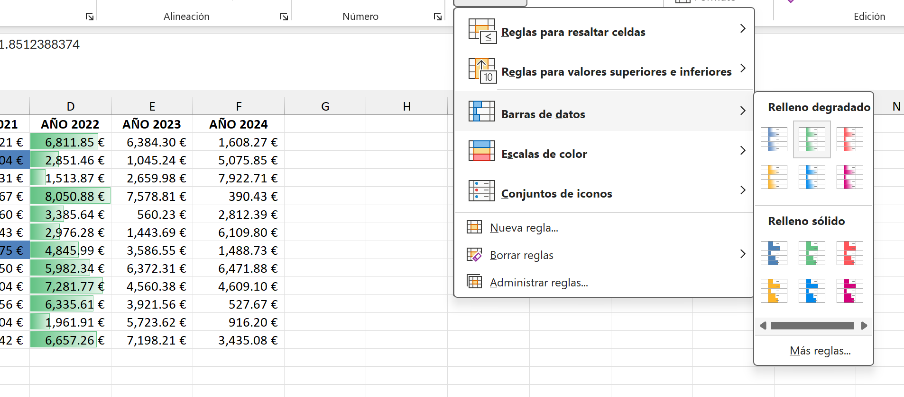

3. Escalas de color:Para medir por colores los valores altos, bajos y medios de las celdas del rango seleccionado.

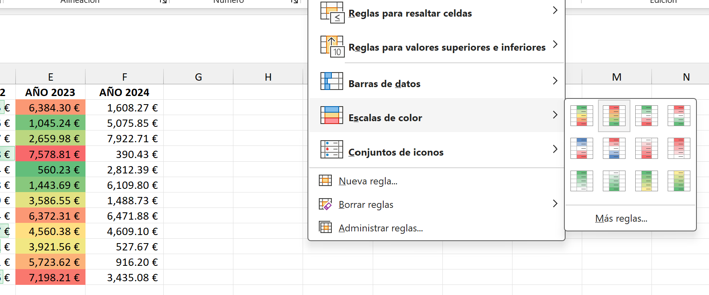

4. Conjunto de iconos: Para indicar con iconos los valores que logran un objetivo, que no llegan a dicho objetivo y que superan el objetivo.

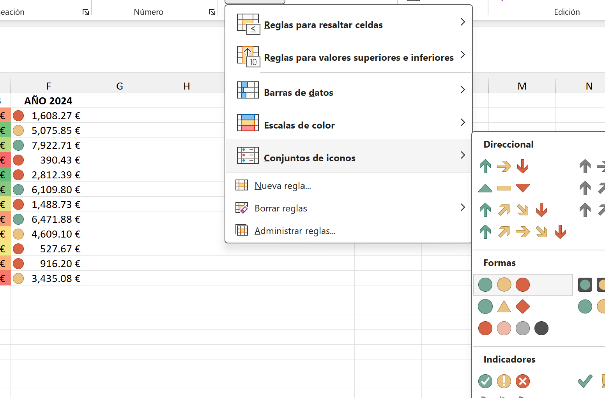

# 8.1. Eliminar o modificar una regla de formato condicional

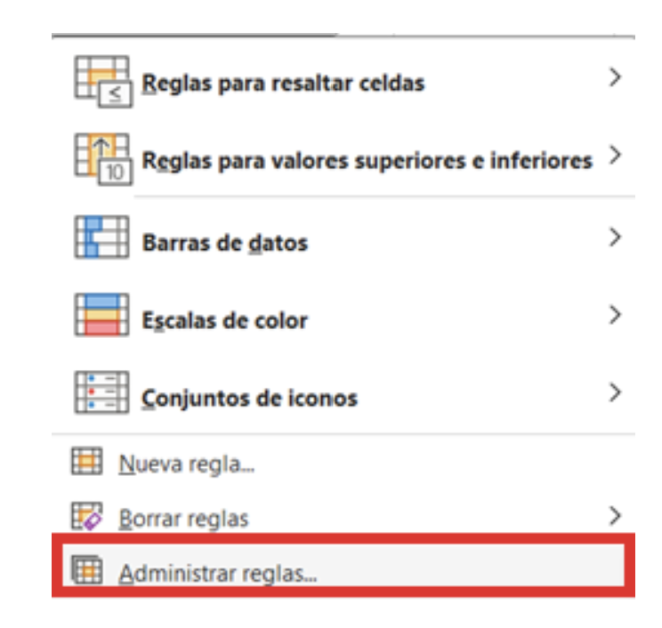

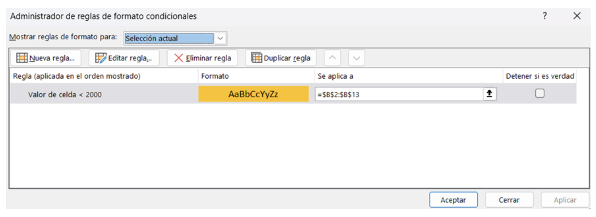

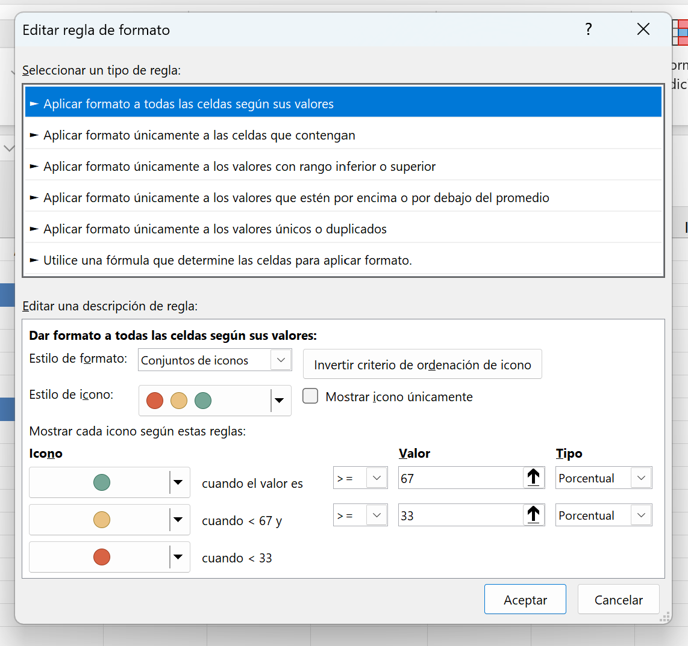

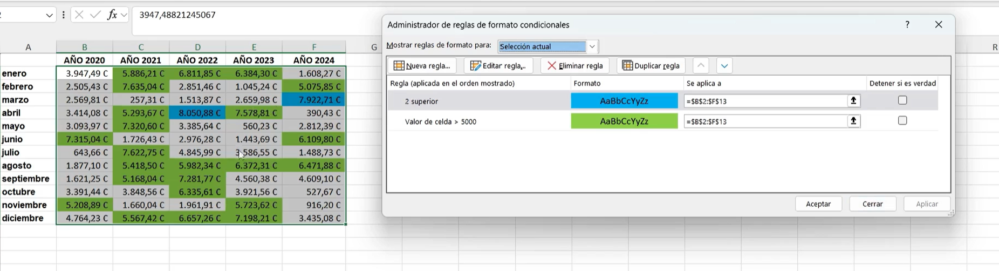

# 8.2. Eliminar reglas del formato condicional
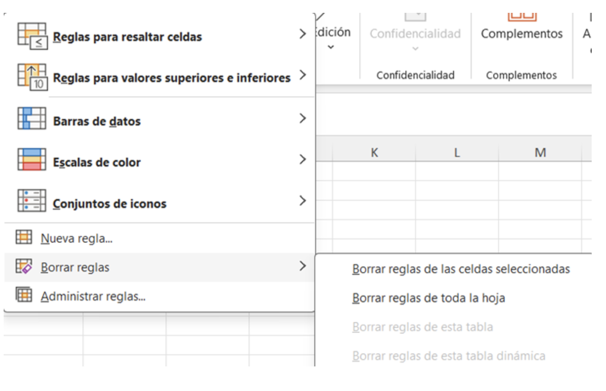

