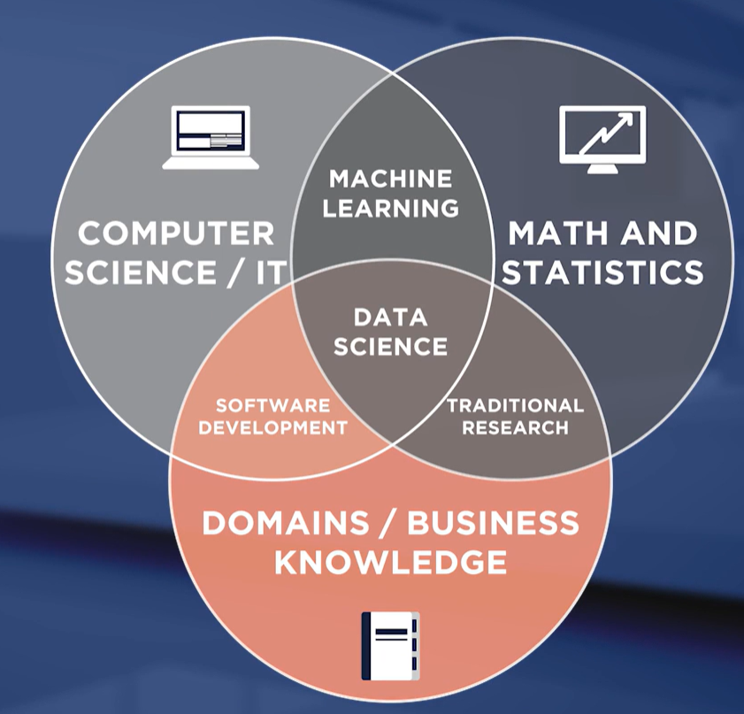
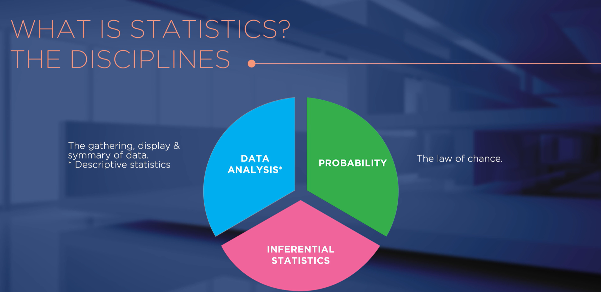
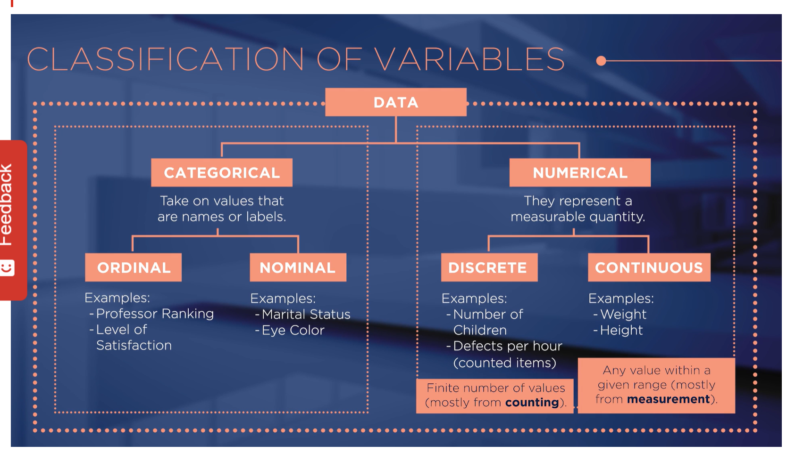
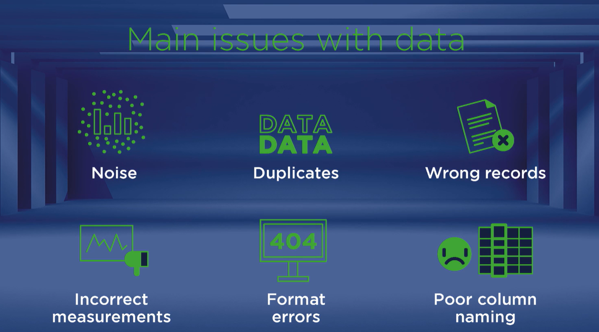

# ¿Qué es la ciencia de datos y por qué es importante?

Un conjunto de tecnicas con las que se extraen soluciones a partir de la informacion que aportan los datos

1. business intelligence: tomar decisiones basado en resultados pasados
2. data analystics: realizar predicciones a futuro

# Introducción al Big Data
La estadistica tiene que ver con nuestra capacidad de cuantificar la incertidumbre para hacer afirmaciones.

Cual es la probabilidad de que algo ocurra en cuestio del estudio de propiedades numericas

Una poblacion engloba todos los objetos de interes 

Una variable describe las caracteristicas de una unidad experimental individual.

Una muestra es un subconjunto dentro de una poblacion

los datos pueden ser estaticos o ser dinaminos y variar en el tiempo    

Existen variables dependientes e independientes

Una unidad experimental se define como cada elemento de interés sobre el que recogemos datos

La inferencia estadística es una estimación o predicción, o incluso una generalización basada en la información contenida en una muestra.

Los datos pueden ser univariantes, es decir, contener una sola variable, o multivariantes, es decir, contener múltiples variables.

 Los datos son hechos y cifras sin procesar, mientras que la información son datos que han sido procesados y organizados para un propósito específico.

# Problemas con los datos
La baja calidad de los datos puede poner en riesgo la fidelidad del resultado en el analisis de datos.

La muestra deberia ser lo mas representativa posible de su poblacion

- El ruido se refiere a grandes cantidades de información adicional sin sentido en el conjunto de datos que puede distorsionar la verdadera señal de información.
- Los duplicados son entradas dobles de la misma información, a menudo introducidas por distintos usuarios, lo que provoca incoherencias y confusiones en los datos.
- Los registros erróneos se refieren a entradas incorrectas insertadas por error en el conjunto de datos.
- Las mediciones incorrectas se refieren a entradas erróneas posiblemente derivadas de registros defectuosos o errores en el método de registro.
- Los errores de formato se refieren a los datos introducidos en un formato incorrecto y que no pueden ser procesados por el científico de datos.
- La mala denominación de las columnas se refiere a la denominación poco informativa de las columnas en los conjuntos de datos, lo que provoca confusión y errores difíciles de corregir, ya que los datos pasan de un equipo a otro o de un científico de datos a otro.
- Los valores faltantes se refieren a las entradas que no están en el conjunto de datos, que requieren un tratamiento especial en función de la naturaleza del problema.
- Los valores atípicos se refieren a valores que son inusualmente más altos o más bajos que el resto de los valores de un conjunto de datos.

