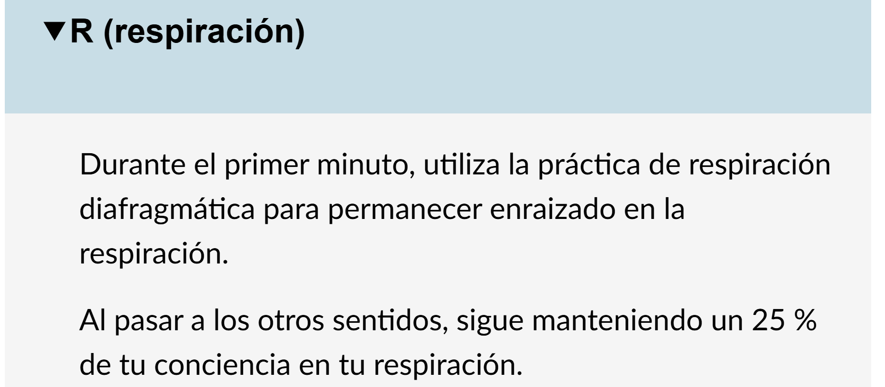
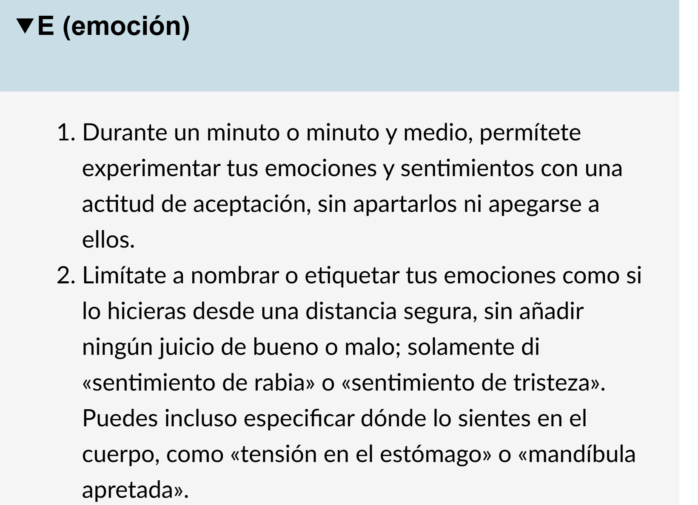
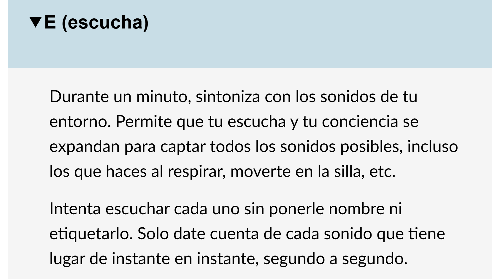
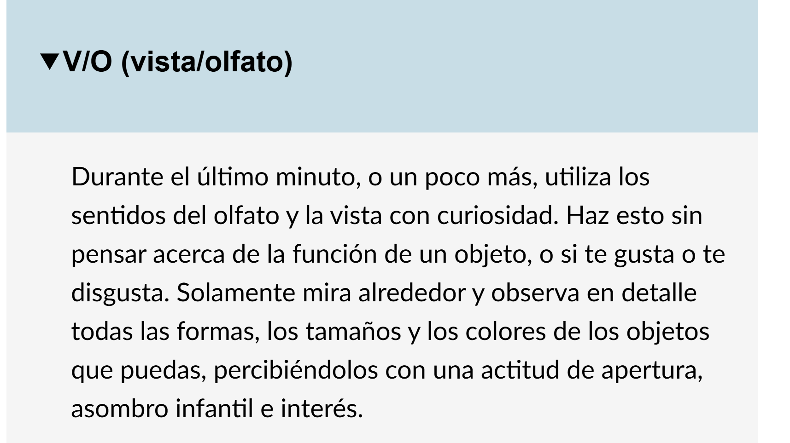
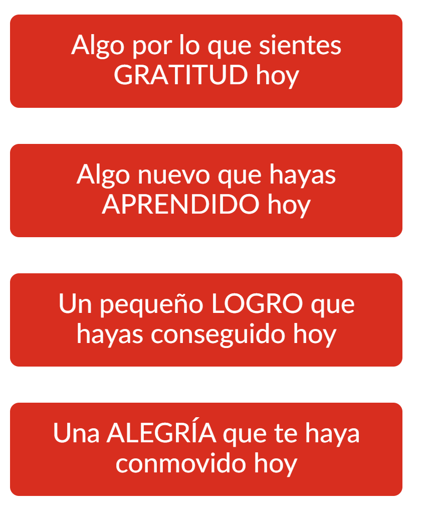
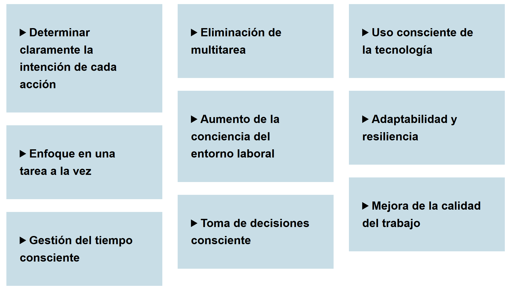
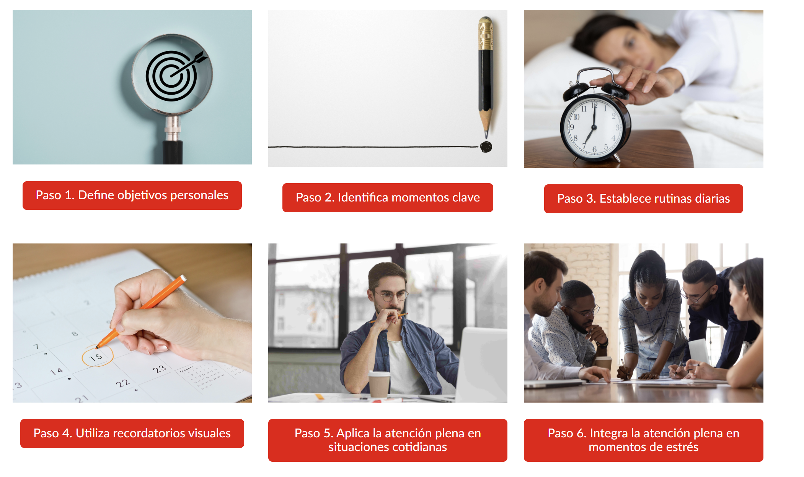

# Introducción al Mindfulness

El **Mindfulness** es la habilidad de dirigir nuestra atención de manera consciente y deliberada hacia el momento presente, sin juzgar. Es el proceso de observar de forma activa los cambios y situarse plenamente en el "aquí y ahora".

### Diferencia entre Meditación y Mindfulness

Aunque están relacionados, no son lo mismo:

- **Meditación:** Es un entrenamiento mental amplio que busca desarrollar concentración, claridad, tranquilidad y conciencia plena.
- **Mindfulness (Atención Plena):** Es una forma específica de meditación centrada en la aceptación de pensamientos, sensaciones y emociones sin juzgarlos. En lugar de dejarse llevar por preocupaciones, la atención se ancla en la experiencia presente.

---

# Mitos e Ideas Erróneas

Un error común es creer que se puede "dejar la mente en blanco". En realidad, es imposible detener el flujo constante de ideas; el mindfulness no busca bloquearlas, sino observarlas sin identificarse con ellas.

---

# Conexión con el Work-Life Balance

La atención plena fomenta el equilibrio entre la vida laboral y personal a través de los siguientes pilares:

1.  **Conciencia del presente:** Permite estar plenamente disponible tanto en el trabajo como en actividades personales.
2.  **Reducción del estrés:** Gestiona eficazmente las demandas laborales al disminuir la rumiación sobre el pasado o la ansiedad por el futuro.
3.  **Mejora de la resiliencia:** Ayuda a aceptar realidades desafiantes y fomenta la paciencia ante la adversidad.
4.  **Calidad sobre cantidad:** Prioriza la profundidad de las interacciones sobre la acumulación de tareas.
5.  **Toma de decisiones:** Facilita el discernimiento entre lo urgente y lo importante, alineando acciones con valores personales.
6.  **Límites saludables:** Ayuda a identificar necesidades propias para aprender a decir "no" y crear espacios de descanso.

---

# Técnicas y Práctica Amable

> **Higiene Mental:** Si dedicas tiempo diario a tu higiene física (ducharte, cepillarte los dientes), ¿no merece tu mente al menos 3 minutos de cuidado diario?

### Adaptación al Estilo de Aprendizaje

El mindfulness es más efectivo cuando se adapta a la persona. Una forma de identificar la mejor técnica es observar las aficiones y pasiones de cada individuo, ya que esto indica qué canales de conexión neuronal son más fuertes.

#### Ejercicios Prácticos:

- **Respiración:** Priorizar la respiración abdominal sobre la pectoral.
- **Movimiento Consciente:** 1. Establecer una intención. 2. Pasar a la acción. 3. Observar el movimiento en detalle (p. ej., sentir el peso en las piernas al caminar).
- **Gestión de Estrés:** Ante la sobrecarga, detenerse y describir: _¿Dónde estoy? ¿Qué hago? ¿Cómo me siento?_
- **Visualización de Calma:** Recrear un escenario relajante con máximo detalle (olores, texturas, sonidos).

---

# Superar el Perfeccionismo

**La regla del 70%:** Es prácticamente imposible mantener un nivel del 100% o un "10 perfecto" de forma constante. Entender que el **7 es el nuevo 10** permite avanzar con sostenibilidad y menos frustración.

---

# Herramientas de Gestión Consciente

### La Técnica GALA

Un método para buscar alegría y equilibrio prestando atención a aspectos positivos que suelen pasar desapercibidos:

- **G:** Gratitud (algo que agradeces).
- **A:** Aprendizaje (algo nuevo hoy).
- **L:** Logro (un pequeño éxito).
- **A:** Alegría (un momento de felicidad).

### Estrategias de Eficiencia

Para mejorar la calidad y velocidad de nuestras acciones:

1.  **Establecer intenciones:** Definir lo más importante antes de iniciar.
2.  **Evitar la multitarea:** La atención plena desalienta el "multitasking" para evitar errores.
3.  **Límites digitales:** Establecer bloques de tiempo para evitar distracciones.
4.  **Presencia en la tarea:** Fomenta la concentración total y el cuidado del detalle.
5.  **Optimización del tiempo:** Eliminar actividades no esenciales para enfocarse en lo significativo.

---

# Plan de Acción

