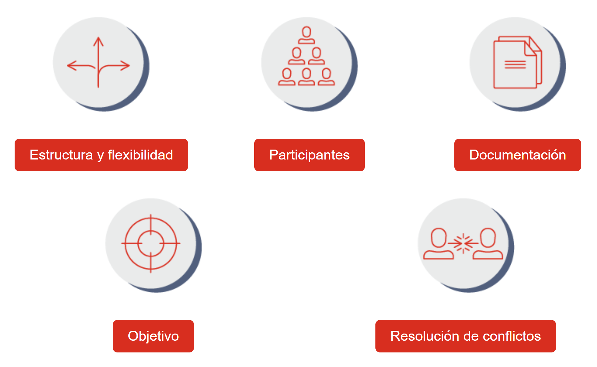

# La negociación

Es un proceso de comunicación en el que dos o más partes tratan de resolver sus diferencias con una solución aceptable para todas las partes.

Estas son las principales diferencias de las negociaciones formales y las informales:

Las negociaciones se desarrollan en estas cinco etapas:

1. Preparación
   Antes de comenzar la negociación, las partes deciden la fecha, el lugar y los principales puntos de la conversación. En esta fase también pueden decidir los límites que están dispuestas a aceptar.

2. Propuesta
   Las partes proponen estrategias para alcanzar un acuerdo o establecer un plan que asegure que todas las partes salgan favorecidas.

3. Debate
   Las partes exponen sus argumentos y perspectivas sobre la situación. En esta etapa, es importante preguntar, escuchar y aclarar las dudas para evitar posibles retrasos y confusiones. Además, deberán detallar las condiciones con las que no están de acuerdo y definir exactamente el objeto de la negociación.

4. Regateo
   Esta es la etapa de intercambio del proceso. Durante el regateo, las dos partes deben intentar salvar las distancias entre sus posiciones y sus intereses.

5. Cierre
   Si las partes alcanzan un acuerdo, deben diseñar un plan de acción para cumplir con lo que establecieron en las fases anteriores.

# Intereses vs. posiciones

Los no establecen paredes, barrerras.
Si dices que no, debes estar seguro de que puedes mantenerlo.

En las negociaciones se debe producir un intercambio entre las partes. Si empezamos la interacción con un "no", la negociación llegará automáticamente a un callejón sin salida.

Intereses: Son los motivos, los valores o las causas subyacentes que justifican la petición de una persona.

Posiciones: Es lo que las partes involucradas en la negociación dicen que quieren. Son declaraciones superficiales que reflejan un interés, pero no permiten conocer el valor, el motivo o la causa real de la petición del interlocutor.

En vez de decir no, las preguntas abiertas pueden ayudarnos a entender los motivos de una petición o el verdadero interés de la otra parte. Las preguntas abiertas exigen una respuesta elaborada y no se pueden responder solo con sí o no

# Un reparto justo del pastel

Puede que la división parezca injusta, ya que Susan se lleva el 80% del pastel y John solo el 20% restante, pero es un reparto justo y satisfactorio para las dos partes porque se adapta a sus necesidades y gustos.

## Uno parte y el otro escoge

Es una manera de alcanzar un acuerdo justo para todas las partes. En este método, una persona corta el pastel y la otra escoge la porción que prefiera. El objetivo es que la persona que corta el pastel lo haga de la manera más equitativa posible porque desconoce la parte que elegirá la otra persona.

## Divide y elige

Las partes involucradas marcan el lugar en el que creen que debería cortarse el pastel. Si las líneas son diferentes, el corte se realiza en el punto intermedio entre las dos propuestas.

## Solución de regateo

Las partes le asignan un valor a cada trozo del pastel. El reparto se realiza de manera que el valor de la suma de los trozos sea el mismo para todas las partes implicadas.

# Tender puentes: las dimensiones

Las empresas pueden resolver el problema de los royalties añadiendo una nueva dimensión a la negociación.

En otras negociaciones, los términos y condiciones pueden concebirse como dimensiones añadidas. En una negociación empresarial, sin embargo, puede que debamos renunciar a algo para asegurarnos de que nuestro cliente acepte el acuerdo en algún otro aspecto.

Piensa en las esferas que utiliza el profesor Plans en el vídeo. En dos dimensiones, las esferas solo tienen un punto en común, pero si se añade una tercera dimensión, las dos esferas conectan en muchos más puntos.
