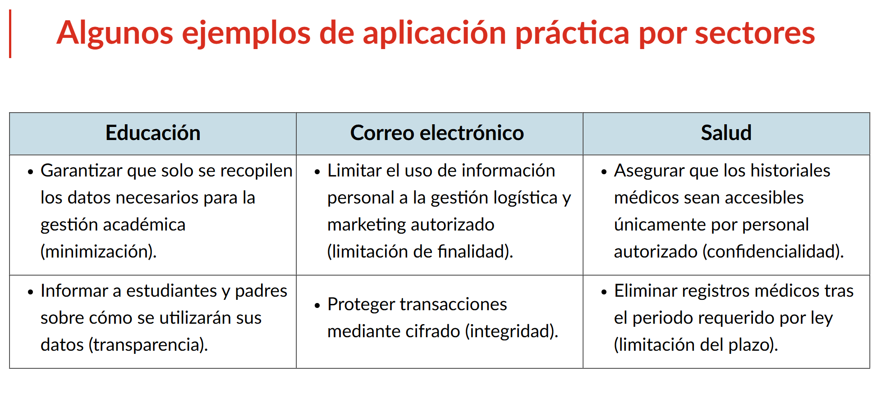
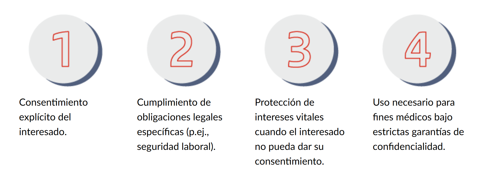
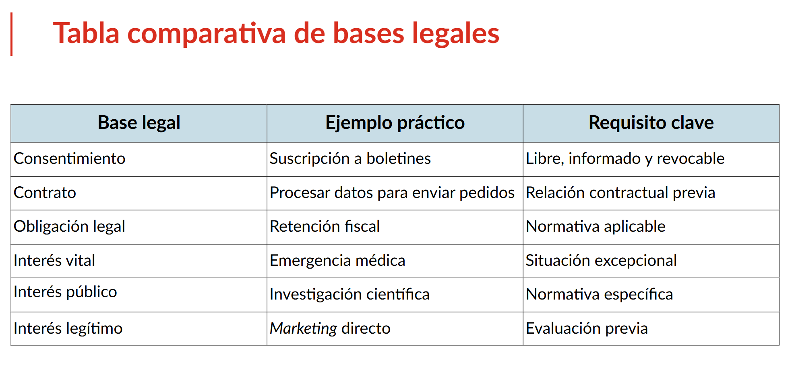
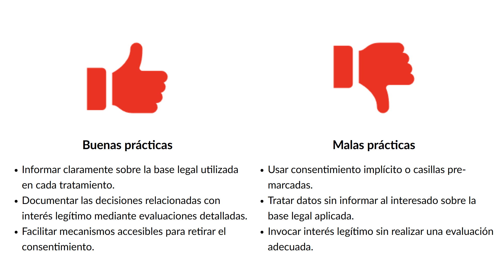
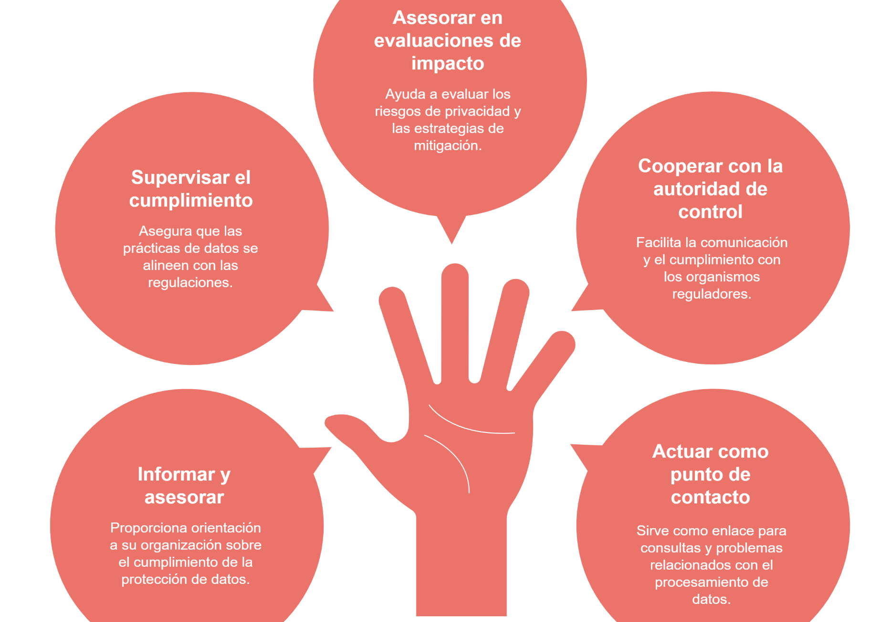
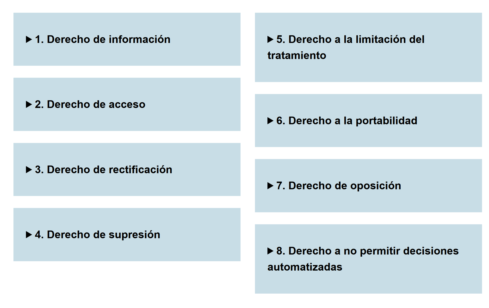
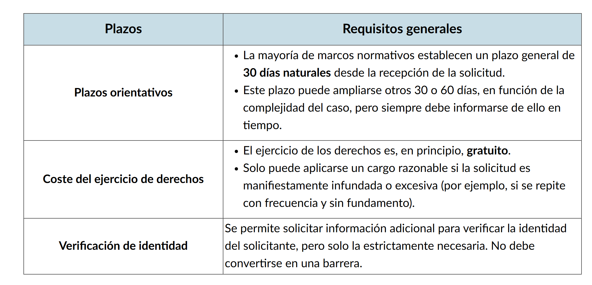
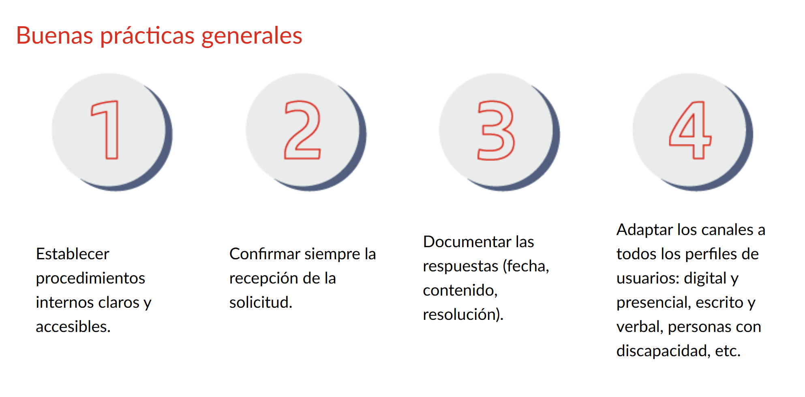

# La Importancia de la Protección de Datos

Cada interacción en internet genera información sobre nosotros. El cumplimiento de la protección de datos no es solo un trámite legal, sino una garantía de que se respetan los derechos de las personas.

- **Impacto directo:** La protección de datos afecta y beneficia a todos los usuarios.
- **Uso Legítimo:** No impide el uso de la información, pero exige que sea **legítimo, transparente, necesario y proporcionado**.
- **Riesgos:** Cada acción deja una huella con potenciales consecuencias jurídicas, económicas y sociales.

---

# ¿Qué se considera un Dato Personal?

Es cualquier información sobre un individuo cuya identidad pueda determinarse **directa o indirectamente**. Lo relevante no es el tipo de dato, sino la posibilidad de vincularlo a una persona concreta.

> **Dato Clave:** La identidad de una persona ya no es solo lo que ella dice de sí misma, sino también lo que los sistemas "saben" de ella al combinar múltiples fuentes de información.

### Privacidad vs. Protección de Datos

- **Privacidad:** La posibilidad de mantener un espacio personal libre de interferencias.
- **Protección de Datos:** Conjunto de reglas que regulan cómo se trata la información para no afectar la integridad del individuo.

---

# Datos Sensibles o Especialmente Protegidos

Son categorías que, por su naturaleza, requieren un tratamiento más riguroso. **Su uso está prohibido por defecto**, a menos que exista una base jurídica específica (como el consentimiento explícito o salud pública).

**Datos delicados que requieren medidas reforzadas:**

- Origen étnico o racial.
- Opiniones políticas, convicciones religiosas o filosóficas.
- Afiliación sindical.
- Datos de salud, genéticos o biométricos.
- Vida sexual u orientación sexual.

---

# Datos Personales de Menores

Los menores son un grupo vulnerable con capacidad limitada para comprender los riesgos del uso de su información.

- **Consentimiento:** Debe ser verificable, específico y otorgado por progenitores o tutores legales.
- **Lenguaje:** La información debe explicarse en términos comprensibles para ellos.
- **Restricciones:** No se pueden crear perfiles publicitarios ni reutilizar sus datos en los mismos términos que los de un adulto.

---

# La Privacidad como Derecho Fundamental

La privacidad ha evolucionado de un concepto filosófico a un derecho fundamental reconocido globalmente. En la era digital, otorga a las personas un **control significativo** sobre sus datos personales bajo principios de minimización y limitación de finalidad.

### Principios Universales de la Privacidad

1.  **Transparencia:** Derecho a saber qué se recopila y para qué.
2.  **Finalidad:** Uso limitado a fines específicos y legítimos.
3.  **Minimización:** Solo recopilar lo estrictamente necesario.
4.  **Exactitud:** Mantener la información precisa y actualizada.
5.  **Limitación de Conservación:** No guardar datos más tiempo del necesario.
6.  **Seguridad:** Implementar medidas técnicas y organizativas de protección.
7.  **Responsabilidad (Accountability):** Las organizaciones deben demostrar que cumplen con estos principios.

---

# Principios Básicos del Tratamiento de Datos

El manejo ético y legal de los datos construye confianza entre las organizaciones y las personas.

1.  **Licitud, lealtad y transparencia:** Políticas de privacidad claras y accesibles.
2.  **Integridad y confidencialidad:** Uso de cifrado, contraseñas seguras y buenas prácticas de seguridad informática.
3.  **Responsabilidad proactiva:** Capacidad de demostrar el cumplimiento normativo.

---

# Bases Legales: ¿Cuándo se puede usar un dato?

No se puede procesar información personal sin una justificación legal válida. Las principales bases son:

- **Consentimiento:** Manifestación libre, específica, informada e inequívoca. _Debe ser reversible (fácil de retirar)._
- **Ejecución de un contrato:** Datos necesarios para cumplir un acuerdo comercial.
- **Obligación legal:** Cumplimiento de leyes impuestas al responsable.
- **Interés vital:** Proteger la vida del interesado o de terceros.
- **Interés público:** Tareas realizadas en ejercicio de poderes públicos.
- **Interés legítimo:** Intereses de la organización que no vulneren los derechos del usuario.

### Casos Especiales y Buenas Prácticas

---

# Roles Clave en el Cumplimiento

1.  **Responsable del tratamiento:** Decide el **qué, para qué y cómo** de los datos. Es el principal obligado legal.
2.  **Encargado del tratamiento:** Trata los datos **por cuenta del responsable** (proveedores, servicios IT). No puede usarlos para fines propios.
3.  **DPO (Delegado de Protección de Datos):** Figura independiente que asesora y supervisa el cumplimiento dentro de la organización.
4.  **Corresponsables:** Cuando dos o más entidades deciden conjuntamente los fines del tratamiento.

---

# Relaciones Contractuales

Toda relación entre responsable y encargado debe formalizarse mediante contratos que incluyan:

- Objeto y duración del tratamiento.
- Deber de confidencialidad.
- Medidas de seguridad técnicas.
- Destino de los datos al finalizar el servicio (devolución o destrucción).

---

# Gestión Práctica de los Derechos del Usuario

Los usuarios cuentan con herramientas legales para controlar su información:

- **Derecho de Acceso:** Saber qué datos se tratan y con quién se comparten.
- **Derecho de Rectificación:** Corregir datos inexactos.
- **Derecho al Olvido (Supresión):** Solicitar la eliminación de datos.
- **Derecho a la Portabilidad:** Recibir los datos en un formato estructurado y común.
- **Derecho de Oposición:** Rechazar el tratamiento en casos específicos.
- **Decisiones Automatizadas:** Derecho a no ser juzgado solo por algoritmos (especialmente en procesos de selección o créditos).

### Implementación y Plazos

