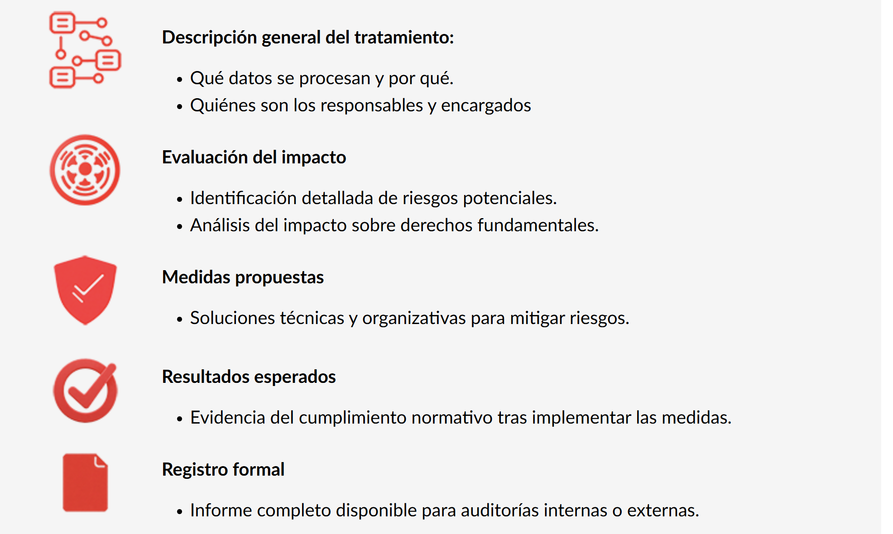
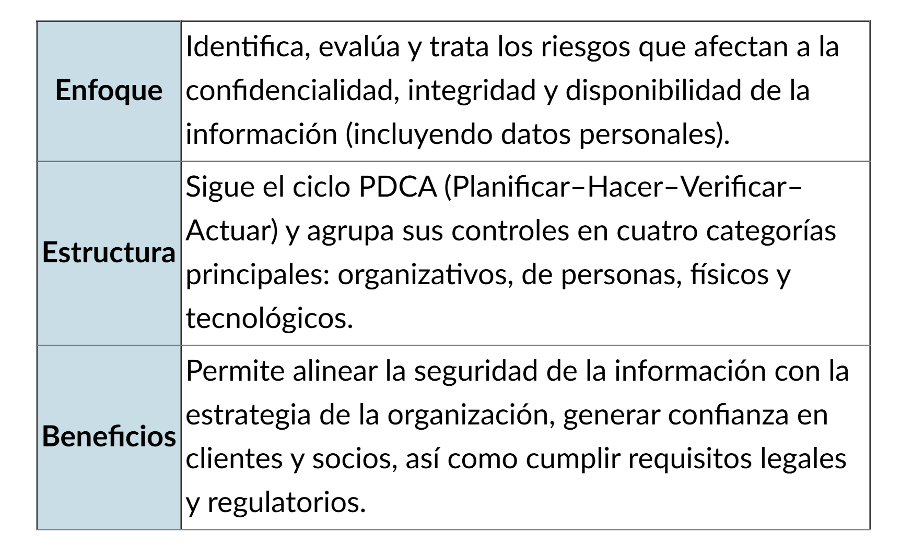
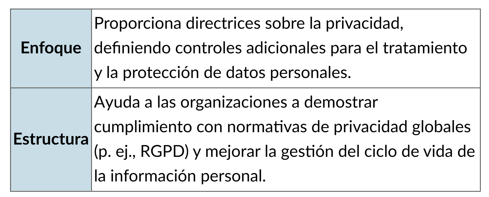
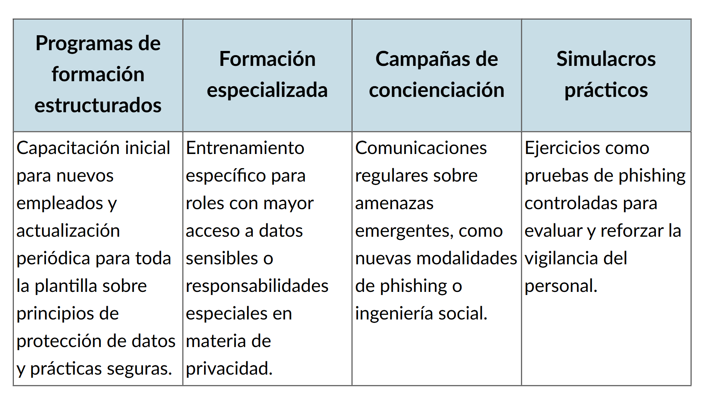
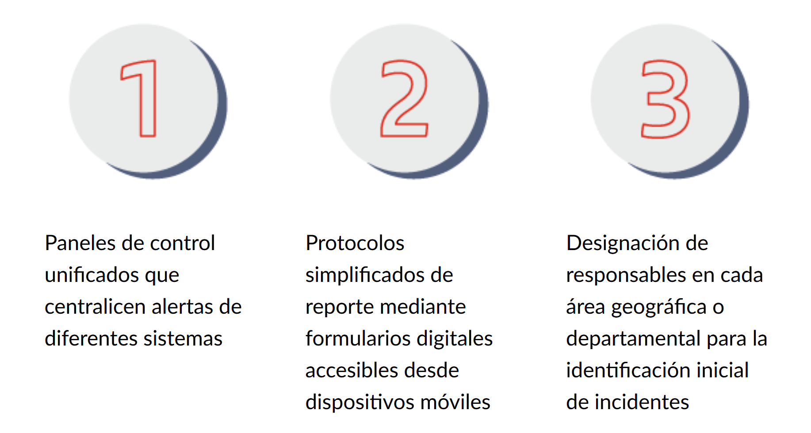
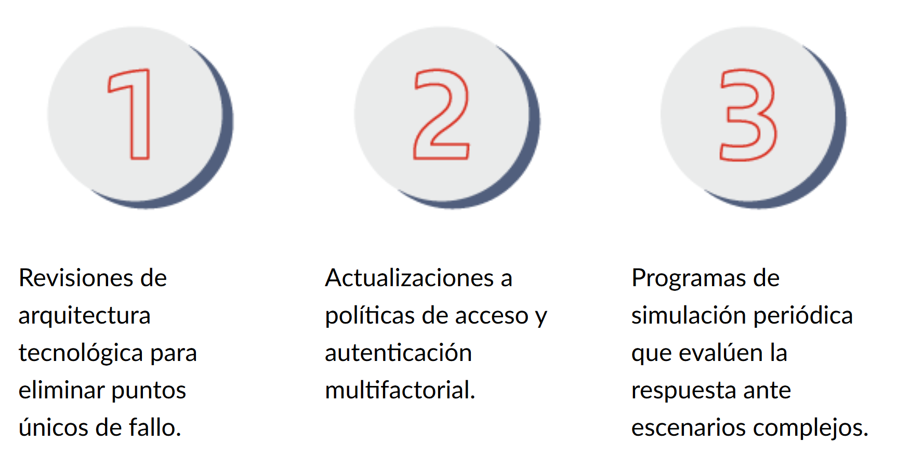
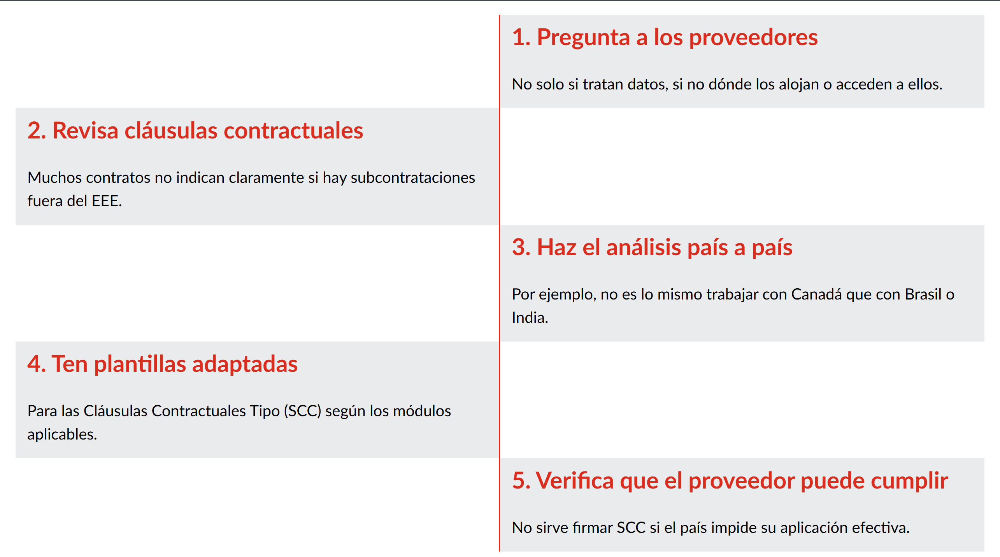
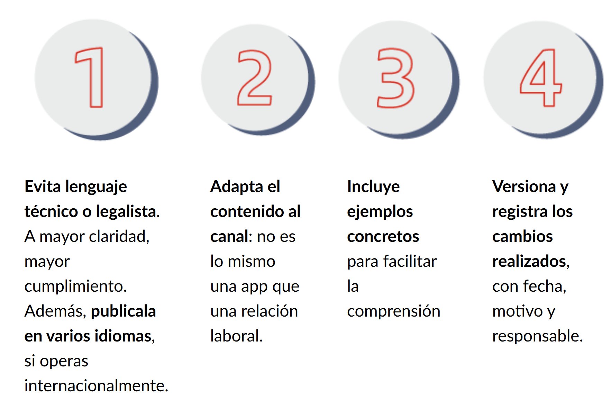
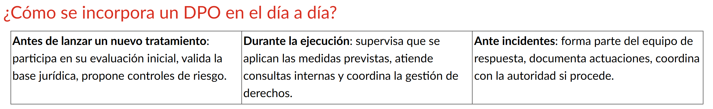
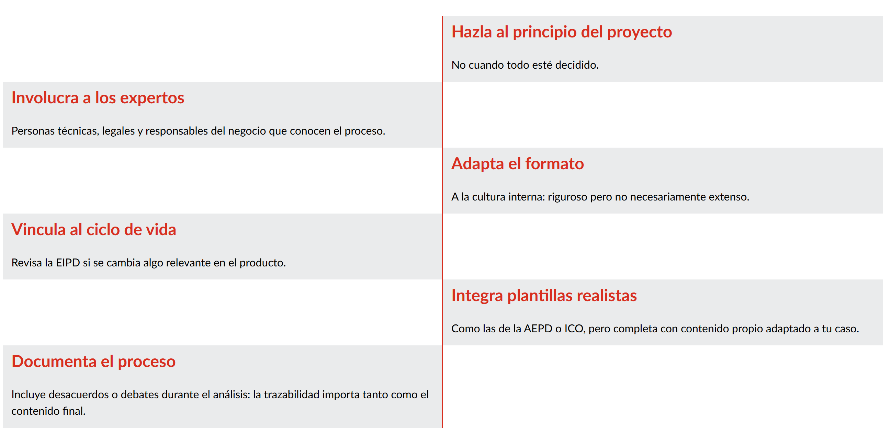

# Evaluación de Riesgos y Medidas Técnicas

La evaluación de riesgos es un análisis sistemático para identificar peligros potenciales al manejar datos personales.

### Pasos para el Análisis de Riesgos:

1.  **Inventario:** Identificar qué datos personales se manejan.
2.  **Mapeo de flujo:** Describir cómo se procesan, dónde se guardan y quién tiene acceso.
3.  **Análisis de necesidad:** Evaluar si es estrictamente necesario recopilar todos esos datos.
4.  **Identificación de amenazas:** Detectar riesgos potenciales (hackeos, fugas, errores humanos).
5.  **Mitigación:** Establecer medidas para reducir los riesgos.
6.  **Documentación:** Detallar todo el análisis para cumplimiento normativo.

---

# Análisis de Impacto (DPIA)

El **DPIA** (_Data Protection Impact Assessment_) es obligatorio cuando el tratamiento de datos implica un **alto riesgo** para los derechos y libertades de las personas.

### ¿Cuándo es necesario realizar una DPIA?

- Uso de **IA o tecnologías innovadoras**.
- Tratamiento **masivo o sistemático** (monitoreo continuo).
- Uso de **datos sensibles** (salud, biometría, política).
- **Decisiones automatizadas** que impacten significativamente al usuario.
- **Transferencias internacionales** a países sin garantías adecuadas.

---

# Seguridad en el Ciclo de Vida del Dato

La protección debe ser constante desde que el dato entra a la organización hasta su eliminación definitiva.

| Fase                  | Acción Clave de Seguridad                                      |
| :-------------------- | :------------------------------------------------------------- |
| **1. Recopilación**   | Avisos de privacidad claros y base legal sólida.               |
| **2. Procesamiento**  | Aplicar seudonimización o anonimización.                       |
| **3. Almacenamiento** | Cifrado en reposo, backups y control de acceso.                |
| **4. Uso y Análisis** | Segmentación de acceso por roles (mínimo privilegio).          |
| **5. Transmisión**    | Cifrado en tránsito (TLS/SSL) y contratos de confidencialidad. |
| **6. Archivo**        | Políticas de retención y acceso limitado.                      |
| **7. Eliminación**    | Destrucción segura y definitiva (Derecho al olvido).           |

---

# Estándares Internacionales y Cifrado

El uso de marcos de referencia internacionales aumenta la confianza y garantiza el cumplimiento legal.

- **ISO/IEC 27001:** Gestión de la Seguridad de la Información. 
- **ISO/IEC 27701:** Gestión de la Privacidad. 

### Tipos de Cifrado

- **En Reposo:** Protege datos almacenados en servidores o bases de datos.
- **En Tránsito:** Protege datos mientras viajan por la red (HTTPS, TLS).
- **Extremo a Extremo:** Solo emisor y receptor pueden descifrar el mensaje.

---

# Medidas de Control y Prevención

Para una protección efectiva, se requieren sistemas que detecten amenazas en tiempo real:

- **IDS (Sistemas de Detección):** Alertas ante actividades sospechosas.
- **Firewalls:** Barreras de filtrado de tráfico.
- **MFA (Autenticación Robusta):** Uso de múltiples factores (contraseña + token).
- **Análisis de Comportamiento:** Detecta desviaciones anómalas en el uso de datos.

---

# Medidas Organizativas y Cultura

La seguridad técnica es inútil sin una estructura organizativa que la respalde.

1.  **Políticas de Privacidad:** Documentos vivos que establecen los compromisos de la empresa.
2.  **Formación y Concienciación:** El factor humano es el eslabón más crítico. 
3.  **Gestión de Incidentes:** Protocolos claros para identificar y contener brechas de seguridad. 

---

# Gestión de Incidentes y Notificaciones

Un incidente es cualquier evento que comprometa la **confidencialidad, integridad o disponibilidad** de los datos.

### Acciones ante una brecha de seguridad:

- **Contención:** Limitar la propagación del ataque.
- **Análisis Forense:** Identificar el alcance (cuántos registros) y el vector de ataque.
- **Notificación:** Informar a las autoridades y a los afectados de forma transparente. 

---

# Transferencias Internacionales y Terceros

Hablamos de transferencia internacional cuando los datos son enviados o accesibles desde fuera del territorio de origen.

- **Riesgo:** Los datos dejan la jurisdicción directa del país de origen.
- **Contratos con Terceros:** El responsable no queda eximido de culpa por externalizar servicios; debe existir un contrato que obligue al proveedor a cumplir las normas. 

---

# Implementación de Políticas de Privacidad

Se recomienda un enfoque de **dos capas**:

1.  **Capa 1 (Resumen):** Información clave visible en el primer contacto (formularios, pies de página).
2.  **Capa 2 (Detalle):** Documento completo con todos los pormenores legales.

### Auditoría y DPO

El **DPO (Delegado de Protección de Datos)** lidera los procesos de revisión y asegura que las evaluaciones de riesgo no sean solo formularios, sino análisis preventivos reales.

