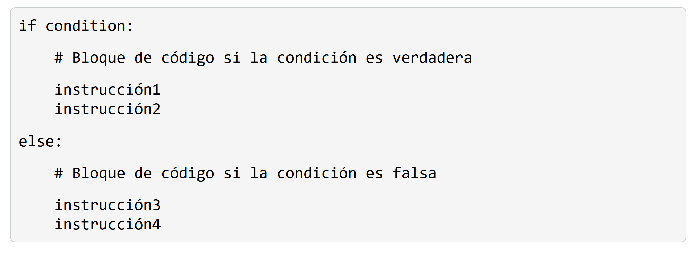
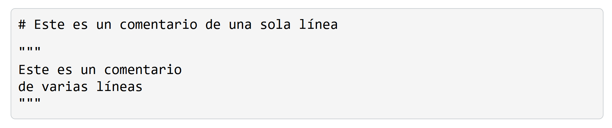

# 1. Introducción a Python

Python utiliza una sintaxis clara y sencilla, lo que facilita la lectura y comprensión del código. Utiliza indentación (espacios o tabulaciones) para delimitar bloques de código, lo que promueve un estilo de programación estructurado y legible.

En Python, no es necesario declarar explícitamente el tipo de datos de las variables. Python infiere automáticamente el tipo de datos en función del valor asignado a una variable, lo que simplifica la escritura de código.

En Python, la indentación (espacios o tabulaciones al inicio de una línea) se utiliza para delimitar bloques de código. Python utiliza la indentación para determinar el alcance de las declaraciones. 

## Comentarios

Python distingue entre mayúsculas y minúsculas. Por lo tanto, variable, Variable y VARIABLE se consideran variables diferentes.

