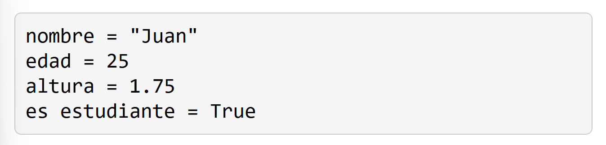
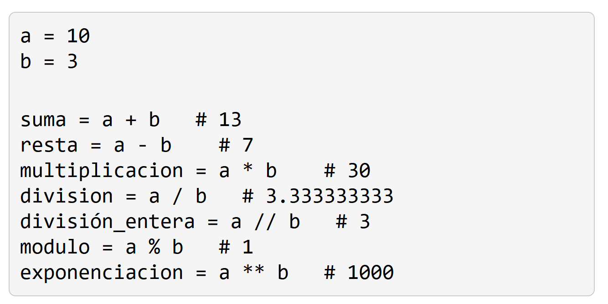
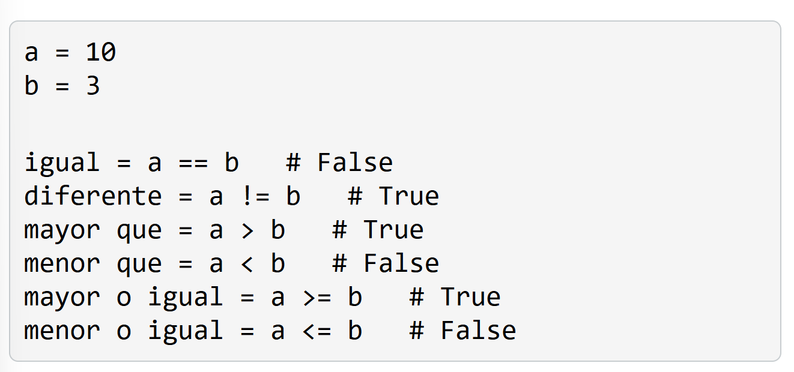
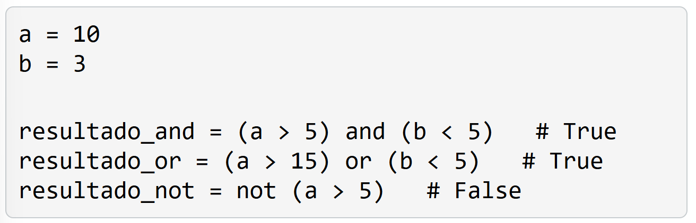

# 2. Fundamentos de Python
## Tipos de datos básicos
Enteros (int)
Flotantes (float)
Cadenas de texto (strings)
Booleanos

# 2.1. Variables
Las variables son contenedores que nos permiten almacenar y manipular datos en nuestros programas. 
En Python, no es necesario declarar el tipo de datos de una variable de antemano, ya que Python infiere el tipo de datos automáticamente en función del valor asignado.

- Los nombres de las variables solo pueden contener letras (a-z, A-Z), números (0-9) y guiones bajos (_). No pueden comenzar con un número.

- No se pueden utilizar palabras clave reservadas de Python como nombres de variables (por ejemplo, if, else, for, while, etc.).

Se recomienda utilizar nombres descriptivos para las variables, que indiquen claramente su propósito

# 2.2. Operadores
Los operadores son símbolos especiales que nos permiten realizar operaciones en variables y valores. Python proporciona diferentes tipos de operadores para realizar operaciones aritméticas, comparaciones y operaciones lógicas.

## Aritméticos
- Suma (+)
- Resta (-)
- Multiplicación (*)
- División (/)
- División entera (//)
- Módulo (%)
- Exponenciación (**)

## De comparación
Los operadores de comparación se utilizan para comparar dos valores y devuelven un valor booleano (True o False) según el resultado de la comparación.

- Igual a (==)
- Diferente de (!=)
- Mayor que (>)
- Menor que (<)
- Mayor o igual que (>=)
- Menor o igual que (<=)

## Lógicos
Los operadores lógicos se utilizan para combinar expresiones condicionales y evaluar múltiples condiciones. 

- AND (and)
- OR (or)
- NOT (not)

