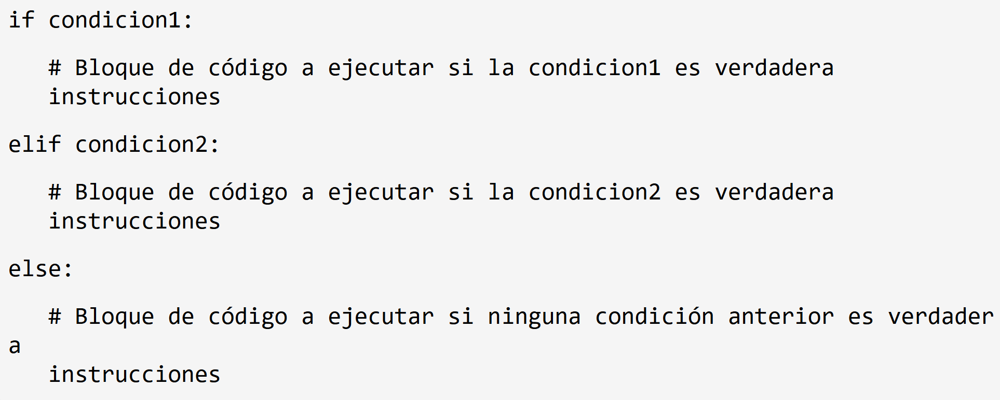
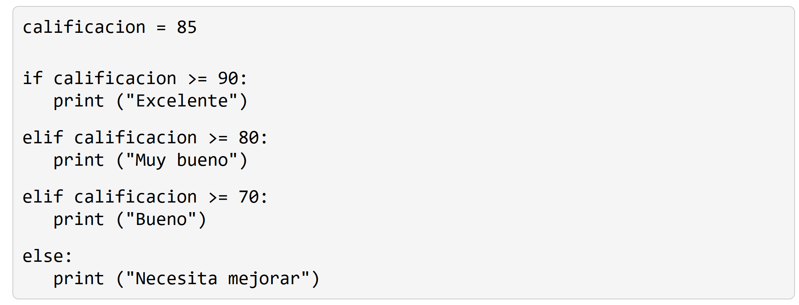
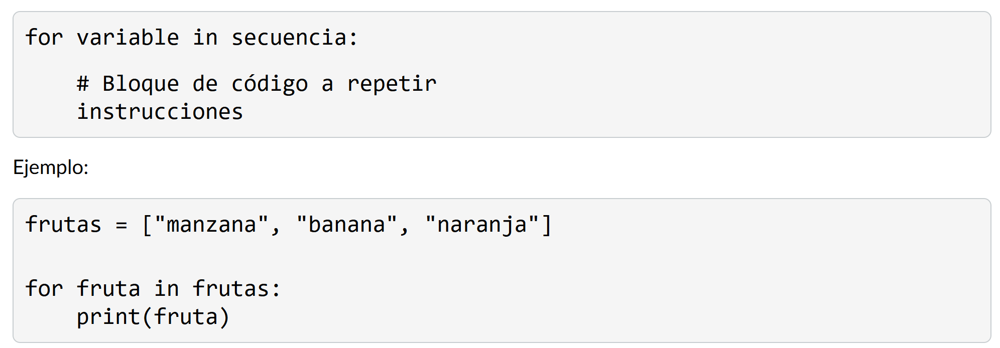
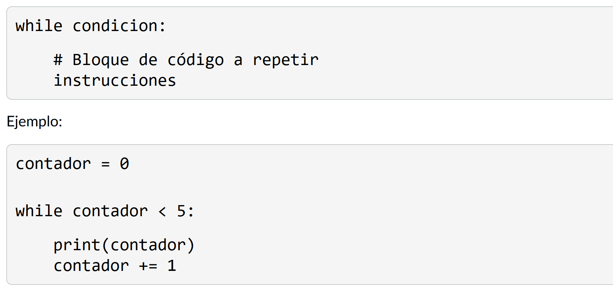
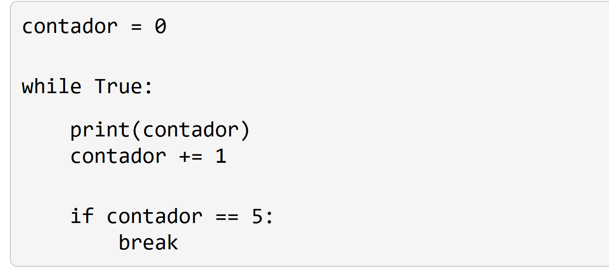
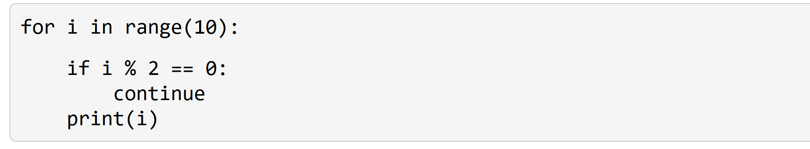
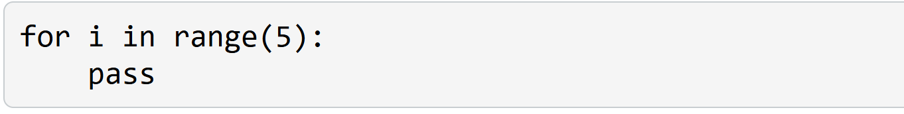

# 3. Estructuras de control

Las estructuras de control nos permiten controlar el flujo de ejecución de nuestros programas. En Python, las estructuras de control más comunes son las estructuras condicionales y los bucles.

## Estructuras condicionales

Las estructuras condicionales nos permiten ejecutar diferentes bloques de código según se cumpla o no una determinada condición.

# 3.1. Bucles/loops

Los bucles nos permiten repetir un bloque de código varias veces.

## For

El bucle for se utiliza para iterar sobre una secuencia (como una lista, una tupla o una cadena) o cualquier objeto iterable.

## While

El bucle while se utiliza para repetir un bloque de código mientras una condición sea verdadera

## Control de bucles

### Break

La instrucción break se utiliza para salir prematuramente de un bucle, independientemente de la condición. Cuando se encuentra un break, el bucle se detiene y el flujo de ejecución continúa con la siguiente instrucción fuera del bucle.

### Continue

La instrucción continue se utiliza para saltar el resto del bloque de código dentro de un bucle y pasar a la siguiente iteración.

### Pass

La instrucción pass es una operación nula que no hace nada. Se utiliza como marcador de posición cuando se requiere una instrucción sintácticamente, pero no se desea realizar ninguna acción.

# Conclusion

Las estructuras de control son herramientas poderosas que nos permiten controlar el flujo de ejecución de nuestros programas. Con las estructuras condicionales (if, if-else, if-elif-else) podemos tomar decisiones basadas en condiciones, mientras que con los bucles (for, while) podemos repetir bloques de código varias veces. Además, las instrucciones break, continue y pass nos brindan un control adicional sobre el comportamiento de los bucles.
