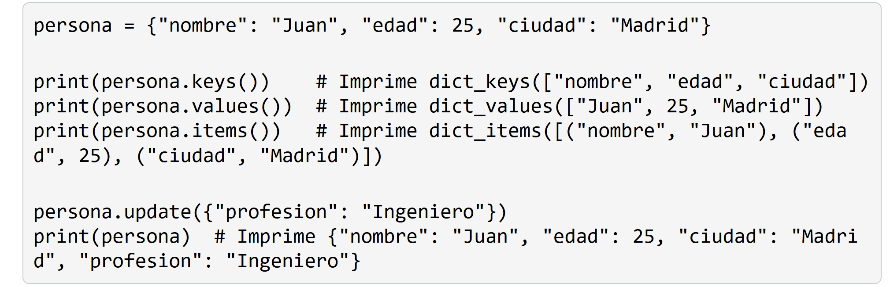
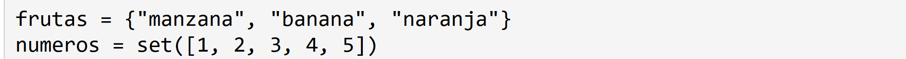
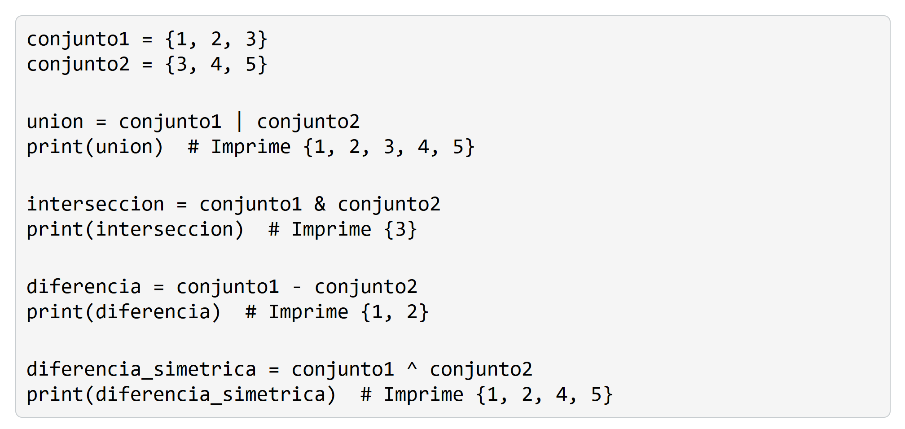
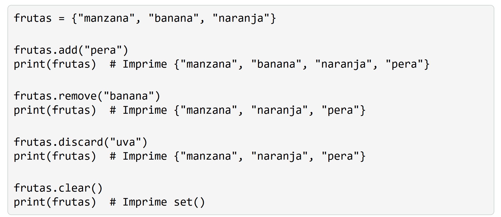

# 4. Estructuras de datos
Las estructuras de datos nos permiten organizar y almacenar datos de manera eficiente en nuestros programas. Python proporciona varias estructuras de datos integradas, como listas, tuplas, diccionarios y conjuntos, cada una con sus propias características y usos.

## Listas
Una lista es una estructura de datos mutable y ordenada que permite almacenar una colección de elementos. Los elementos de una lista pueden ser de diferentes tipos de datos y se encierran entre corchetes [].

        frutas = ["manzana", "banana", "naranja"]

        print(frutas[0])  # Imprime "manzana"
        print(frutas[1])  # Imprime "banana"
        print(frutas[2])  # Imprime "naranja"

        print(frutas[-1])  # Imprime "naranja"
        print(frutas[-2])  # Imprime "banana"
        print(frutas[-3])  # Imprime "manzana"

### Metodos de lista

    frutas = ["manzana", "banana", "naranja"]

    frutas.append("pera")
    print(frutas)  # Imprime ["manzana", "banana", "naranja", "pera"] - agrega un elemento al final de la lista

    frutas.insert(1, "uva")
    print(frutas)  # Imprime ["manzana", "uva", "banana", "naranja", "pera"] - inserta un elemento en una posición específica de la lista.

    frutas.remove("banana")
    print(frutas)  # Imprime ["manzana", "uva", "naranja", "pera"] - elimina la primera aparición de un elemento en la lista.

    fruta_eliminada = frutas.pop(2) # elimina y devuelve el elemento en una posición específica de la lista
    print(frutas)  # Imprime ["manzana", "uva", "pera"]
    print(fruta_eliminada)  # Imprime "naranja"  

    frutas.sort() # ordena los elementos de la lista en orden ascendente.
    print(frutas)  # Imprime ["manzana", "pera", "uva"]

    frutas.reverse() # invierte el orden de los elementos en la lista.

    print(frutas)  # Imprime ["uva", "pera", "manzana"]

# 4.1. Tuplas
Una tupla es una estructura de datos inmutable y ordenada que permite almacenar una colección de elementos. Los elementos de una tupla se encierran entre paréntesis (), separados por comas.

    punto = (3, 4)

    print(punto[0])  # Imprime 3
    print(punto[1])  # Imprime 4

A diferencia de las listas, las tuplas son inmutables, lo que significa que no se pueden modificar una vez creadas. No se pueden agregar, eliminar o cambiar elementos en una tupla existente.

Las tuplas son útiles cuando necesitas almacenar una colección de elementos que no deben modificarse

    mi_tupla = (1, 2, 3, 2, 4, 2)

    print (mi_tupla.count(2)) # devuelve el número de veces que aparece un elemento en la tupla. 

    print (mi_tupla.index(2))   # Salida: 1
    print (mi_tupla.index(2, 2))   #Salida: 3
    print (mi_tupla.index(2, 2, 4))   #Salida: 3

    print (len(mi_tupla)) # devuelve la longitud de la tupla.

# 4.2. Diccionarios
Un diccionario es una estructura de datos mutable y no ordenada que permite almacenar pares de clave-valor. Cada elemento en un diccionario consiste en una clave única y su valor correspondiente. Los diccionarios se encierran entre llaves {}, y los pares clave-valor se separan por comas.

persona = {"nombre": "Juan", "edad": 25, "ciudad": "Madrid"}

print(persona["nombre"])  # Imprime "Juan"
print(persona["edad"])    # Imprime 25
print(persona["ciudad"])  # Imprime "Madrid"

# 4.3. Conjuntos (set)
Un conjunto es una estructura de datos mutable y no ordenada que permite almacenar una colección de elementos únicos. Los conjuntos se encierran entre llaves {} o se crean utilizando la función set().

Las estructuras de datos en Python nos brindan una gran flexibilidad y potencia para almacenar y manipular datos en nuestros programas. Las listas son útiles para colecciones ordenadas y mutables, las tuplas para colecciones ordenadas e inmutables, los diccionarios para almacenar pares clave-valor y los conjuntos para colecciones no ordenadas de elementos únicos.