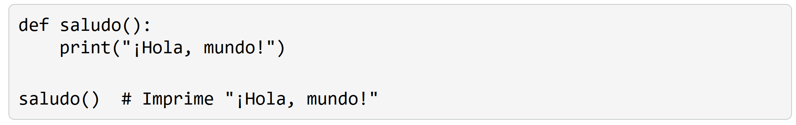
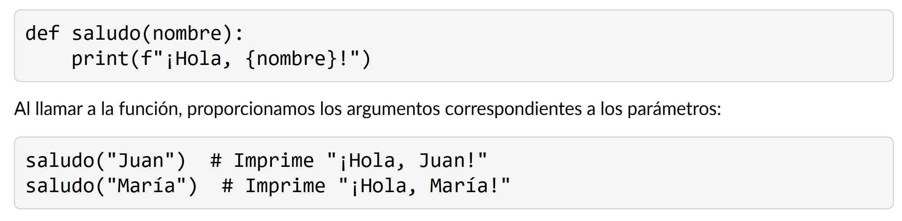
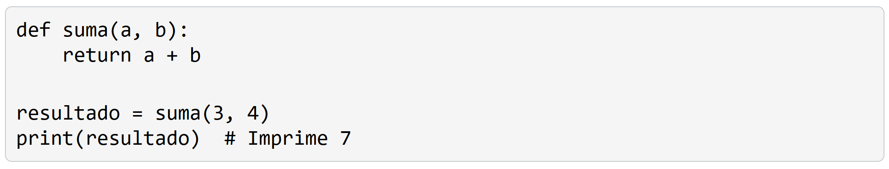
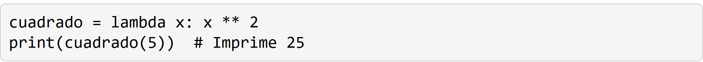
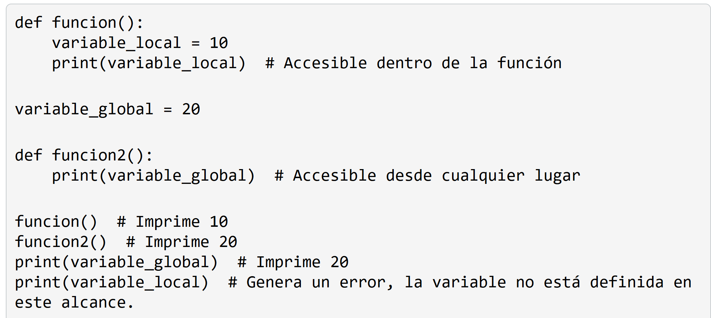
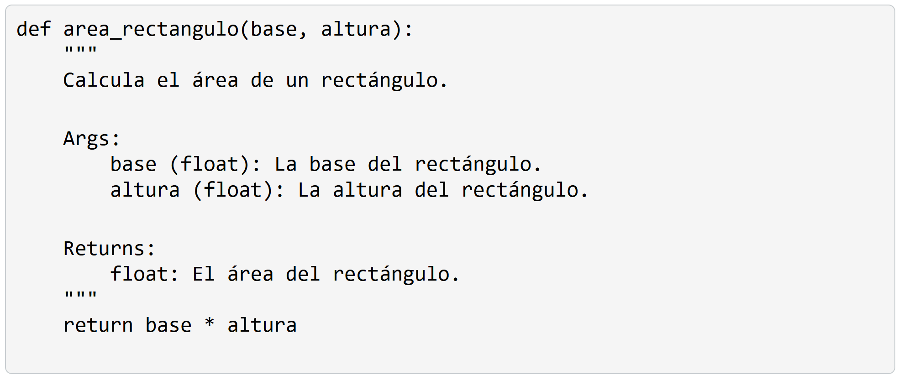
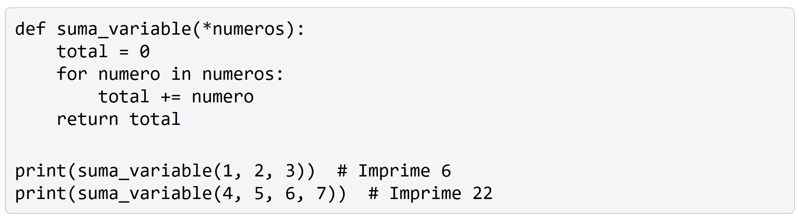

# 5. Funciones
Las funciones son bloques de código reutilizables que nos permiten encapsular tareas específicas y ejecutarlas cuando sea necesario. Las funciones nos ayudan a organizar nuestro código, evitar la repetición y hacer que nuestros programas sean más modulares y fáciles de mantener.

## Funciones anónimas (lambda)
Python permite crear funciones anónimas o funciones lambda, que son funciones sin nombre definidas en una sola línea. Se utilizan comúnmente para funciones pequeñas y concisas.

## Alcance de las variables (local vs. global)
Las variables definidas dentro de una función tienen un alcance local, lo que significa que solo son accesibles dentro de la función. Por otro lado, las variables definidas fuera de cualquier función tienen un alcance global y pueden ser accedidas desde cualquier parte del programa.

Es una buena práctica documentar nuestras funciones utilizando docstrings. Los docstrings son cadenas de texto que describen el propósito, los parámetros y el valor de retorno de una función. 

Python permite definir funciones que acepten un número variable de argumentos. Esto se logra utilizando el operador * antes del nombre del parámetro.

