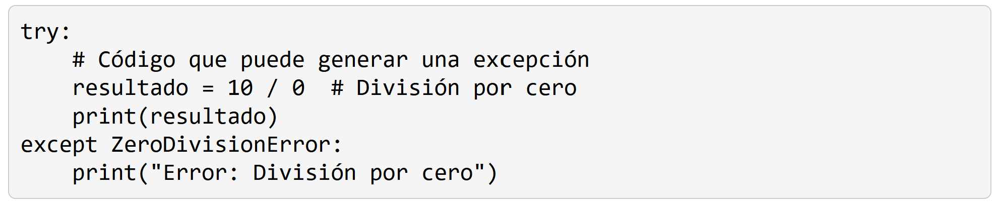
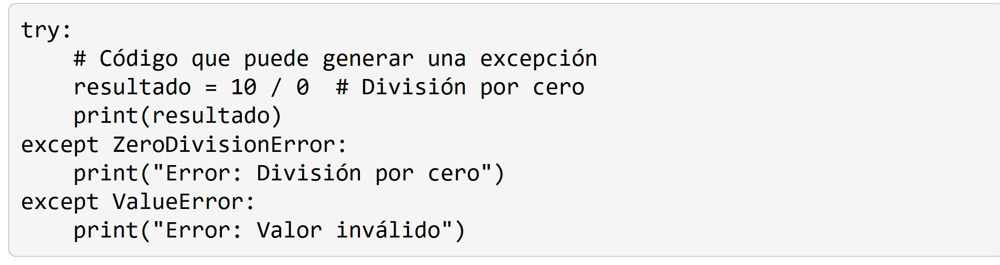
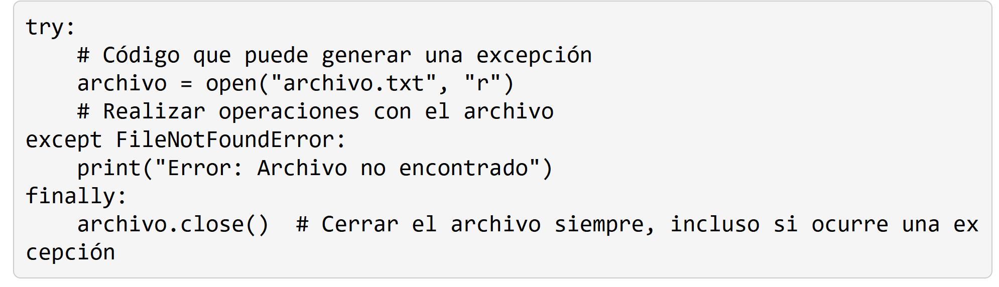
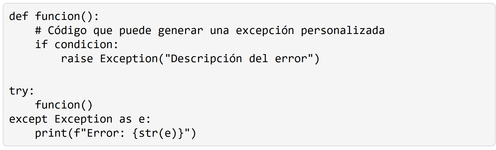

# 6. Manejo de errores y excepciones
Cuando escribimos programas, es común encontrarnos con situaciones inesperadas o errores durante la ejecución. Esto nos permite capturar y manejar errores específicos sin que el programa se detenga abruptamente.

## Errores comunes en Python
- Error de sintaxis (SyntaxError)
- Error de nombre (NameError): cuando se hace referencia a una variable o función que no ha sido definida.
- Error de tipo (TypeError): Ocurre cuando se realiza una operación con tipos de datos incompatibles
- Error de índice (IndexError):Ocurre cuando se intenta acceder a un índice fuera del rango válido

Cuando ocurre un error, Python genera una excepción y muestra un mensaje de error que incluye el tipo de excepción y una descripción del problema.

# 6.1. Manejo de excepciones
El manejo de excepciones nos permite capturar y manejar errores de manera controlada utilizando las declaraciones try, except y opcionalmente finally.

- Try: contiene el código que puede generar una excepción. Si ocurre una excepción dentro del bloque try, el flujo de ejecución se transfiere al bloque except correspondiente.

- Except: especifica el tipo de excepción que se desea capturar y manejar. Puedes tener múltiples bloques except para manejar diferentes tipos de excepciones.

- Finally: es opcional y se ejecuta siempre, independientemente de si ocurrió una excepción o no. Se utiliza comúnmente para realizar tareas de limpieza o liberación de recursos.

# 6.2. Excepciones personalizadas
Además de las excepciones incorporadas en Python, también puedes crear tus propias excepciones personalizadas. Esto es útil cuando deseas manejar situaciones específicas de tu programa.

