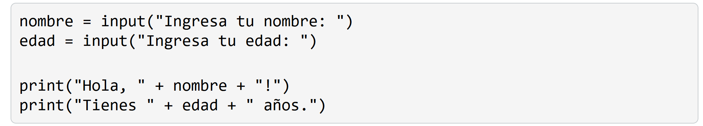
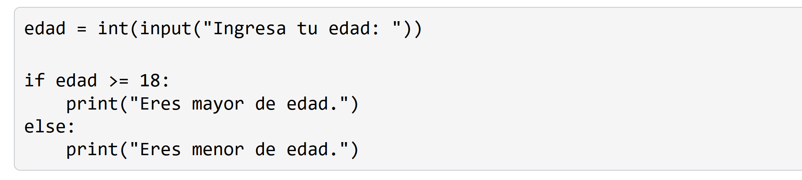
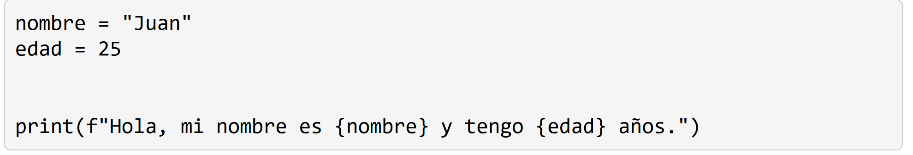
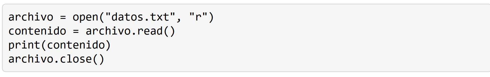
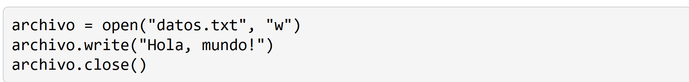
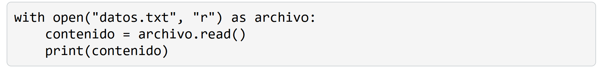

# 7. Entradas/salidas
En Python, la entrada y salida de datos nos permite interactuar con el usuario y manipular archivos. Podemos solicitar información al usuario, mostrar resultados en la pantalla y leer o escribir datos en archivos externos.

## Entrada de datos del usuario

La función input() siempre devuelve una cadena de texto. Si deseas trabajar con otros tipos de datos, como números enteros o flotantes, debes realizar una conversión explícita utilizando funciones como int() o float().

## Salida de datos
Para mostrar información en la pantalla, utilizamos la función print(). Esta función toma uno o más argumentos y los muestra en la consola.

Podemos utilizar la f-string (formateo de cadenas) para incrustar variables directamente dentro de una cadena de texto.

# 7.1. Lectura y escritura de archivos
Python nos permite leer y escribir datos en archivos externos. Podemos abrir archivos en diferentes modos, como lectura ("r"), escritura ("w") o anexar ("a"), y realizar operaciones de lectura y escritura.

## Lectura de archivos

## Escritura de archivos
Para escribir datos en un archivo, lo abrimos en modo de escritura ("w") utilizando la función open(). Si el archivo no existe, se creará automáticamente. Si el archivo ya existe, su contenido se sobrescribirá.

Es importante cerrar siempre los archivos después de utilizarlos para liberar los recursos del sistema. 

También puedes utilizar la declaración with para manejar la apertura y cierre de archivos de manera automática.

En este caso, el archivo se abre utilizando la declaración with y se cierra automáticamente una vez que se sale del bloque with, incluso si ocurre una excepción.