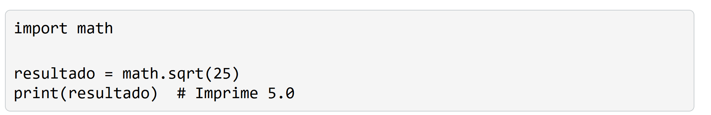
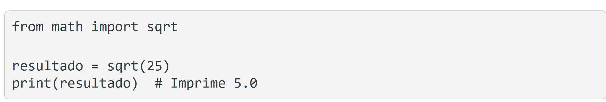
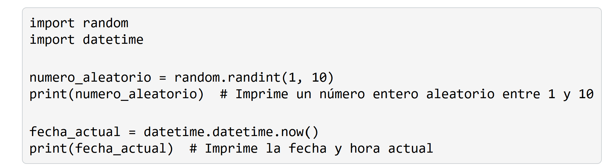
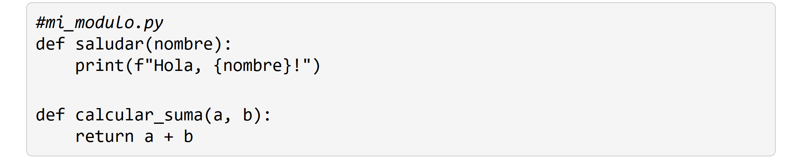
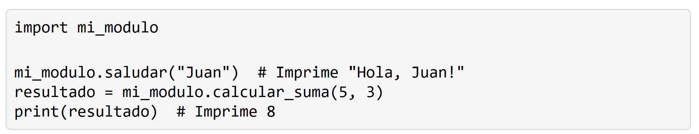
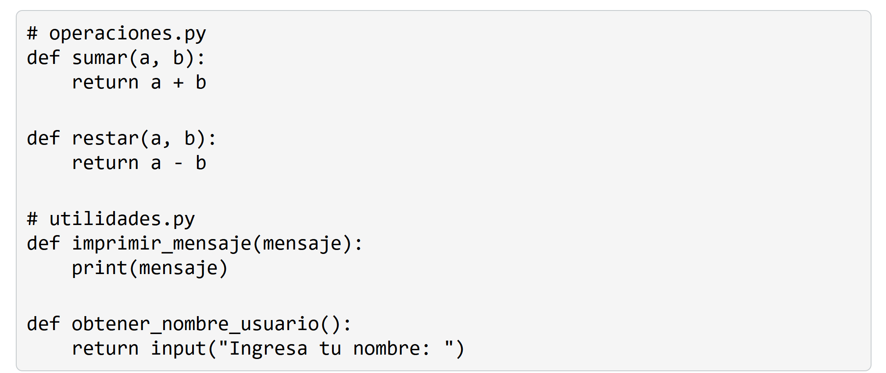
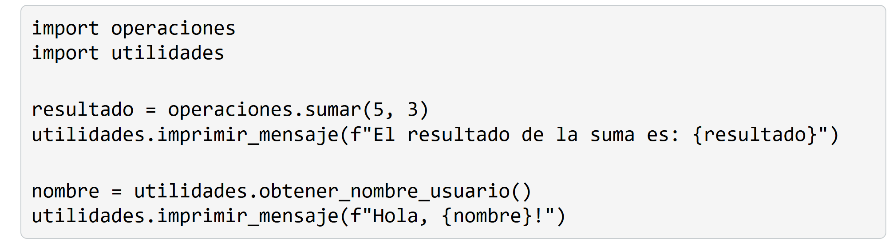
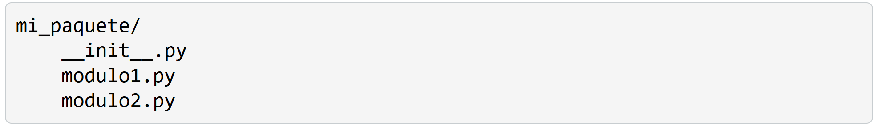
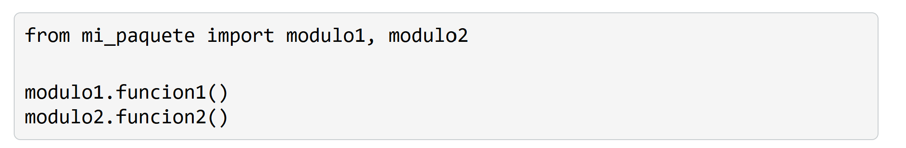

# 8. Importación y creación de módulos
un módulo es un archivo que contiene definiciones de funciones, clases y variables que se pueden utilizar en otros programas. La importación de módulos nos permite acceder a la funcionalidad definida en otros archivos y reutilizar código de manera eficiente.

## Importar módulos

# 8.1. Creación de módulos propios

## Organización del código en módulos
A medida que nuestros programas crecen en tamaño y complejidad, es una buena práctica organizar nuestro código en módulos separados según su funcionalidad. Esto nos permite conservar un código más legible, agrupado en módulos y fácil de mantener.

# 8.2. Paquetes
Un paquete es una forma de organizar módulos relacionados en una estructura jerárquica de directorios. Los paquetes nos permiten agrupar módulos relacionados y evitar conflictos de nombres entre módulos.

## Crear y utilizar paquetes
Para crear un paquete, creamos un directorio con el nombre deseado y agregamos un archivo especial llamado __init__.py dentro del directorio.

